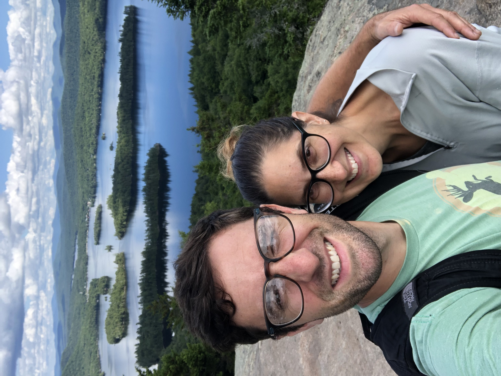

```{=html}
<style>
    
h1 {
    font-family: 'Kanit', sans-serif;
    font-weight: 600;
    font-style: normal;
    color: #3D3D3D;
    font-size: 70px;
    letter-spacing: 10px; 
    text-align:center;
}

h2 {
    font-family: 'Kanit', sans-serif;
    font-weight: 365;
    color: #3D3D3D;
    font-style: normal;
    font-size: 32px;
    letter-spacing: 1.7px; 
    text-align:center;
}

.logo {
  display: block; /* Ensure it's a block-level element */
  margin: 0 auto; /* Center horizontally */
  width: 100px;
  height: auto; /* Maintain aspect ratio */
}

.text {
      font-family: 'Roboto', sans-serif;
      font-weight: 400;
      color: #3D3D3D;
      font-size: 24px
      letter-spacing: 1.15px;
      text-align:left;
      }
      
.center {
  display: block;
  margin-left: auto;
  margin-right: auto;
  width: 75%;
}
</style>
```
<hr>

<div>


</div>

::: {style="overflow: hidden;"} 
<!-- Ensures the container wraps around floated elements -->

<figure style="float: right; margin-left: 20px;">

<!-- Floats the figure to the right and adds space between the text and the image -->



<figcaption style="float: center; width:240px; font-size: .8em;">

<i>My wife and I hiking in the Adirondacks in 2022.</i>

</figcaption>
</figure>

::: text
I’m a passionate GIS professional and data analyst with an abiding love of the natural world.
From an early age growing up in the Berkshires of Massachusetts, where summer meant attending Audubon camp, overnights in the Adirondack Mountains, and exploring my own backyard, I developed a deep appreciation for nature, natural spaces, and the value of time spent outdoors.
I seek to honor that appreciation by applying my skills in ways that enhance environmental conservation efforts, contribute to ecological research, and promote sustainable practices.

I’ve been fortunate to develop my professional skillset in a variety of arenas.
This includes working as a GIS analyst with the City of Newport New, Virginia on a range of projects, from gun violence mapping and analysis to laying the groundwork for an urban tree inventory; collaborating to provide GIS and technical support for an ongoing project that seeks to increase equity and intentionality in urban agriculture by identifying optimal urban sites using geospatial modelling; and providing programmatic data wrangling, analysis, and scripting in R in support of important research around environmental water quality and climate change.
:::

Professional growth is essential. I am constantly working to refine my abilities and to learn and develop new skills.
Recently I have been digging in to PostgreSQL with PostGIS to build out/host a relational spatial database, how to leverage the Python API to access Google Earth Engine, and using the Natural Earth public vector dataset for enhanced cartography.

I am bilingual in English and Spanish, and hold a Master of Spanish from Middlebury College.
Prior to pursuing a career path in GIS and data analysis, I worked for many years teaching Spanish at the secondary school level.
The COVID-19 pandemic provided me the time and opportunity to think seriously and with clarity about redefining my professional life.
I was fortunate to be in a position to take the leap, and to have a supportive partner at home who encouraged me throughout the process.

And I love birds and birding.
They provide intellectual fascination, aesthetic richness, and a unique connection to the natural world.
Nothing gives greater pleasure than to spend time deep in an eastern hardwood forest during early summer, falling asleep to the sound of whip-or-wills and owls and waking to the dawn chorus of thrushes, warblers, and vireos.
What a gift to be able to experience it all.

</div>

:::
