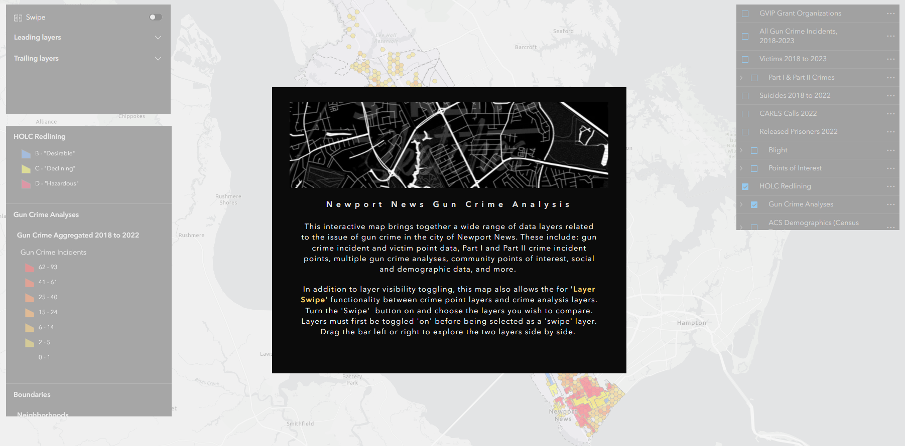

```{=html}
<style>
h1.title {
    font-family: 'Kanit', sans-serif;
    font-weight: 600;
    font-style: normal;
    font-size: 62px;
    letter-spacing: 8px; 
    text-align:center;
}

h2 {
    font-family: 'Kanit', sans-serif;
    font-weight: 500;
    font-style: normal;
}

h3 {
    font-family: 'Kanit', sans-serif;
    font-weight: 380;
    font-style: normal;
}

.text {
      font-family: 'Roboto', sans-serif;
      font-weight: 400;
      font-size: 24px
      letter-spacing: 1.15px;
      text-align:center;
      }
      
.text2 {
      font-family: 'Roboto', sans-serif;
      font-weight: 400;
      font-size: 24px
      letter-spacing: 1.15px;
      }

.row {
  display: flex;
  flex-wrap: wrap; /* Allows items to wrap */
  justify-content: center; /* Centers items horizontally, adjust as needed */
}

.column {
  flex: 1; /* Adjust this to control how columns grow */
  max-width: 45%; /* Maximum width of each column */
  padding: 5px;
  box-sizing: border-box; /* Includes padding in the element's total width and height */
}
</style>
```
<hr>

R and RStudio are essential components of most (if not all) of my workflows.
From geospatial projects and data analysis, to data visualizations and producing documents and reports, R is an incredibly powerful tool.
Here are some examples of ways I have used R to conduct my own analysis, provide research support, assist colleagues, and for my own pet projects. You can also check out some source code for the projects in knitted R Markdown files. 

<br>
<hr>

<br>

::: {style="text-align: center;"}
## climate change effects on Virginia reservoirs
:::

<div style="text-align: center; margin-top: 20px; margin-bottom: 15px;">
<a href="media/animatedplot.gif" target="blank"></a>
</div>


My most recent project for the Bukaveckas Lab at VCU involved analyzing the effects of climate change on Virginia reservoirs. Between February and July of 2024 I contributed to a forthcoming peer-reviewed publication that examines the effects of climate change on reservoirs throughout Virginia. This involved carrying out median-based linear modeling (MBLM) to assess long-term trends in temperature and dissolved oxygen at 41 lake stations across the state. MBLM was selected for its robustness to outliers, which ensured more reliable results in the presence of  irregular data points, occurring either as a result of extreme weather conditions or instrument error. The analysis was based on a large data set from Virginia Department of Environmental Quality  comprising ~19,00 profiles from over 500 stations across more than 100 reservoirs in the state. The stations selected for the study were chosen based on their having at least 100 profiles available for analysis. For each station, month-by-month trends from May to October were calculated, along with intra-annual trends focusing on the period from April to August each year.

I really enjoyed this project, not only because it gave me a chance to learn about and apply a new statistical method in the context of valuable climate-focused research, but because it presented me with some opportunities for data visualization and applying my GIS and spatial analysis chops. Exploratory analysis involved, among other things, testing various environmental factors, such as latitude, longitude, to uncover potential spatial gradients and temporal patterns that might explain variability in the data. I had a rewarding - if rather challenging - experienc trying to create a plot, using our data, based on a figure from another publication. This involved some pretty advanced `ggplot2` concepts to achieve the desired formatting and layout. Plus, I got to make a cool map (!) for publication that shows the locations of the trend analysis sites and the watersheds they are located in. This gave me a chance to try to develop a compelling color scheme and layout that was be both visually appealing and informative.

All in all, this project is built on quite a few Markdown files. Below are a couple of examples.


- <b><a href="portfolio/DOMin_Mean_Range_trends.html" target="blank">source code for deriving DO trends and producing corresponding box-whisker plots </a></b>
- <b><a href="portfolio/longTermAnnualTrends_AprtoAug.html" target="blank">source code for deriving Apr to Aug site trends + generating plot</a></b>

<br>
<hr>

<br><br> <!-- NEW SECTION -->

::: {style="text-align: center;"}
## visualizing water temperature over time
:::

<div style="text-align: center; margin-top: 20px; margin-bottom: 15px;">
<a href="media/animatedplot.gif" target="blank"></a>
</div>


Another fun and challenging project I was able to do for the Bukaveckas Lab involved combining 15 years of water quality monitoring data to generate daily mean summary statistics for select variables, as well as produce an animated plot depicting seasonal patterns and inter-annual variation in water temperature at VCU's Rice River Center monitoring station. 

This required quite a bit of wrangling and problem solving to get from A to B. I made extensive use of nested list structures to organize and manage the data, which allowed me to systematically separate and categorize data by year and tab across and within Excel workbook files. This  was critical given the inconsistency in the data schema and variable naming conventions over the 15 years that data were collected.

I was already familiar with R's `ggplot2` before beginning this project, but the need for a dynamic plot gave me the chance to explore the `gganimate` package - something I look forward to doing more of in the future!

- <b><a href="portfolio/james_longterm.html" target="blank">data wrangling source code</a></b>
- <b><a href="portfolio/animatedplot.html" target="blank">animated plot source code</a></b>

<br>
<hr>

<br><br> <!-- NEW SECTION -->


::: {style="text-align: center; font-size: 17px;"}
## bird diversity in grassland vs forest ecosystems

### class-level landscape metrics as predictors of avian species richness
:::
<div class="text2">
For this analysis, completed as the final project for landscape ecology (ENVS 591) during the fall of 2023 at VCU, I was interested in exploring the extent to which class-level landscape metrics differ in their ability to explain variation in avian species richness (total \# of different species) in grassland ecosystems versus forest ecosystems.

The whole project was carried out using **R** in RStudio, and was a great opportunity to conduct a spatial analysis outside of a point-and-click GIS environment. Not using ArcGIS Pro meant not enjoying the convenience of 'on-the-fly projection', which required me to be especially attentive to coordinate reference systems and projections as I prepared spatial data from different sources for analysis.
I also became familiar with a number of great spatial R packages and APIs, including `mapview`, `terra`, `sf`, `raster`, `FedData`, and `landscapemetrics`.

This project gave me a chance to work with data sets from the National Ecology Observatory Network (NEON), a comprehensive ecological monitoring program that collects standardized, high-quality data from diverse ecosystems across the United States.
Check out the maps below - which I made in R using the `mapview` package - to see the NEON sites used in my analysis.

```{r, warning=FALSE, message = FALSE, echo = FALSE}
library(dplyr)

source("other/le_script.R")

# Bring together primary point layers for each study area
plots <- rbind(bland_final, serc_final, smith_final,kona_final, konz_final, kans_final)


plots <- plots %>%
  mutate(studyarea = case_when(
    grepl("KONA", substr(plotYear, 1, 4)) ~ "Konza Prairie Agroecosystem",
    grepl("KONZ", substr(plotYear, 1, 4)) ~ "Konza Prairie Biological Station",
    grepl("UKFS", substr(plotYear, 1, 4)) ~ "University of Kansas Field Station",
    grepl("BLAN", substr(plotYear, 1, 4)) ~ "Blandy Experimental Forest",
    grepl("SCBI", substr(plotYear, 1, 4)) ~ "Smithsonian Conservation Bio. Inst.",
    grepl("SERC", substr(plotYear, 1, 4)) ~ "Smithsonian Experimental Research Center",
    TRUE ~ NA
  ))

plots$studyarea <- as.factor(plots$studyarea) # Make factor for zcol=
plots$studyarea <- factor(plots$studyarea, 
                          as.character(unique(plots$studyarea)))


plots.sf <- sf::st_as_sf(plots, crs = 4326, coords = c("decimalLongitude", "decimalLatitude"))

labels_df <- data.frame(
  studyarea = c("GRASSLAND SITES", "FOREST SITES"),
  decimalLongitude = c(-96.49, -79),
  decimalLatitude = c(40, 36.68)     
)

# Convert to sf object
labels_sf <- sf::st_as_sf(labels_df, coords = c("decimalLongitude", "decimalLatitude"), crs = 4326)

# Create maps for each ecosystem type -- must reset the factor levels. This was easier than typing the entire study area name
forest <- plots.sf[grepl("Bland|Smith", plots.sf$studyarea),]
forest$studyarea <- as.character(forest$studyarea)
forest$studyarea <- as.factor(forest$studyarea)
grassland <- plots.sf[grepl("Konz|Kans", plots.sf$studyarea),]
grassland$studyarea <- as.character(grassland$studyarea)
grassland$studyarea <- as.factor(grassland$studyarea)
```

::: row
::: col-md-6
```{r, fig.height = 4, fig.width = 4, echo = FALSE}
mapview::mapview(
  forest, 
  zcol = "studyarea", 
  cex = 3.5,
  layer.name = "Forest Study Sites", 
  map.types = "CartoDB.Positron", 
  col.regions = c("#ED6A5E", "#E9D985", "#007991")
)
```
:::

::: col-md-6
```{r, fig.height = 4, fig.width = 4, echo= FALSE}

mapview::mapview(
  grassland, 
  zcol = "studyarea", 
  cex = 3.5,
  layer.name = "Grassland Study Sites", 
  map.types = "CartoDB.Positron",
  col.regions = c("blue3", "salmon2", "aquamarine3")
  )

```
:::
:::

<br>

My analysis used three years of data (2019-2021) from three separate study areas in each of the two landscape types.
Study areas comprised 10-20 distinct study plots, with each 'plot-year' combination representing a unique sampling event (n=228).
For each plot-year combination, I calculated the total number of bird species observed.
I pulled in National Land Cover Data using `FedData` and generated buffers around each plot-year at 200m, 500m, 1000m, and 2000m in order to assess the influence of landscape metrics at different spatial scales.

Before calculating landscape metrics I first reclassified the NLCD data using a reclassification matrix to produce new raster datasets with simplified land cover categories (forest, agricultural, and urban).
I then used the `landscapemetrics` package to calculate 5 class-level metrics for each buffer size:


<div style="text-align: center; margin-top: 30px; margin-bottom: 30px;">
  <figcaption style="text-align: center; font-size: .87em;">
    <i>Data preprocessing R workflow</i>
  </figcaption>
  
</div>


Five landscape metrics across four buffer sizes produced a total of 20 variables to be considered as potential predictors of species richness in each ecosystem type. Given time constraints, I took a bit of a shortcut to select variables for modelling. I utilized a tiered hierarchical approach by applying the `corSelect()` function from the `fuzzySim` package (v. 4.10.5). Minimally correlated variables were first selected at each spatial extent and those selected variables were then further evaluated together to make a final selection. The approach was pragmatic, but I would like to eventually return to this analysis and tailor variable selection by better integrating domain-specific ecological knowledge.

With variables selected, I applied a generalized linear mixed model approach to incorporate *study* area as a random effect. This produced a 'singular fit', however, indicating that the model was overfitted -- that is, the random effects structure was too complex to be supported by the data. Instead, I utilized multiple regression to fit models for every possible combination of predictor variable, then compared models using AIC to select the top performers and identify the most important predictors. 

<b>tl;dr version</b> 

* In mid-Atlantic forests, only elevation and % forest cover were found to be significant predictors of avian species richness. 
* In grasslands, both PLAND at 1000m and AI at 1000m were found to be significant predictors.
* A significantly higher amount of variation in avian species richness was explained by grassland model (42.6%) than forest models (<12%).

Here's a <b><a href="portfolio/le_final.pdf" taget="_blank">PDF version of a presentation</a></b> that gives a more detailed look at some of the results.
</div>

<br>
<hr>

<br><br> <!-- NEW SECTION -->

::: {style="text-align: center;"}
## gun data preprocessing automation
:::

::: row
<div style="text-align: center; margin-top: 20px; margin-bottom: 15px;">
  
</div>
:::


The <a href="https://andrewmcameron.github.io/geospatial.html#urban_gun_crime">urban gun crime work</a> that I did during my time as a member of the City of Newport News GIS team gave me the chance to carry out some interesting spatial analyses and work on developing several apps with the Esri tool kit, including Experience Builder, Dashboards, and web maps (none of which are public-facing, unfortunately).
But in order to get to that point, the data generated from the police department's record management system query first needed substantial massaging and preparation.

To accommodate the need for re-running analyses and updating the dashboard annually or semi-annually with new data, I developed a script to automate the otherwise laborious task of preprocessing the raw RMS query outputs.
I wrote the script in a heavily annotated R Markdown file, so that future users can easily interact with it using RStudio's 'visual' mode and execute the code with little to no knowledge of R required.
The user needs only to define two variables: a new folder name and the path of the Excel workbook file containing the raw data.
The script takes care of the rest.
The end result is two CSV files ready to be brought into ArcGIS Pro and geocoded.

- <b><a href="portfolio/Script1_InitialDataProcessing.html" target="blank">source code</a></b>

<br>
<hr>

<br><br> <!-- NEW SECTION -->

::: {style="text-align: center;"}
## modelling estuarine algal blooms
:::

<div style="text-align: center; margin-top: 20px; margin-bottom: 15px;">
<a href="media/chla_modelsuccess.png" target="blank"></a>
</div>

I've been fortunate to be able to provide water quality research assistance to the <a href="https://blogs.vcu.edu/pabukaveckas/" target="blank">Bukaveckas Lab</a> at Virginia Commonwealth University, in the form of program scripting, data analysis, and data visualization, since December of 2023.

Among other projects, I developed a script to facilitate the longitudinal analysis and modeling of <a href="https://blogs.vcu.edu/pabukaveckas/research/james-river-ecosystem-study/" target="_blank">chlorophyll a (CHLa) levels in the James River</a> using multiple linear and nonlinear approaches.

The knitted HTML output contains tables with summary statistics for the all years in the data set; regression statistics for all years combined, as well as individual years, by model; model plots with best fit line; model-specific time series plots; and time series plots for CHLa and dissolved organic nitrogen.

The script is designed to dynamically adapt to changes in the dataset, accommodating new data from subsequent years without requiring manual updates to its structure or content.

More detailed program documenation is available <a href="https://github.com/andrewmcameron/modelling-algalBlooms/blob/main/README.md" target="_blank">on my Github page</a>.

-   <b><a href="portfolio/chla_script_noEval.html" target="_blank">source code</a></b>

<br>
<hr>

<br><br> <!-- NEW SECTION -->


::: {style="text-align: center;"}
## intro to `osmdata`
:::

This was less a coding project and more a way to help folks in my office use some basic coding to programmatically access the <a href="https://www.openstreetmap.org/#map=11/42.1759/-71.4407" target="blank">OpenStreetMap</a> database. 

Newport News, VA has an amazing <a href="https://geohub.nnva.gov/" target="_blank">Geohub site</a>, but - for obvious reasons - the city does not maintain spatial data layers on *every* feature that exists in the city. After a colleague shared in a meeting that she had to quickly put together a suitability analysis using features that she pulled in from multiple sources around the web - e.g., shopping, grocery stores, cinemas,  bowling alleys, and sundry other sites for leisure activities - it occurred to me that the GIS team could benefit from being able to leverage the OpenStreetMap API in this sort of situation, should it arise again in the future. 

I created a tutorial, adapting from this <a href="https://cran.r-project.org/web/packages/osmdata/vignettes/osmdata.html" target="blank">excellent and more comphrensive vignette</a></b> on the CRAN website, for using R's `osmdata` package. It is written with the goal that someone who had never used R or RStudio before would nevertheless be able to access the API, pull in the data they are looking for, and export it as a JSON that they can pull into the ArcGIS Pro environment for use in mapping and analysis. 

-  <b><a href="portfolio/OSMdata_tutorial.html" target="blank">`osmdata` tutorial</a></b> 

