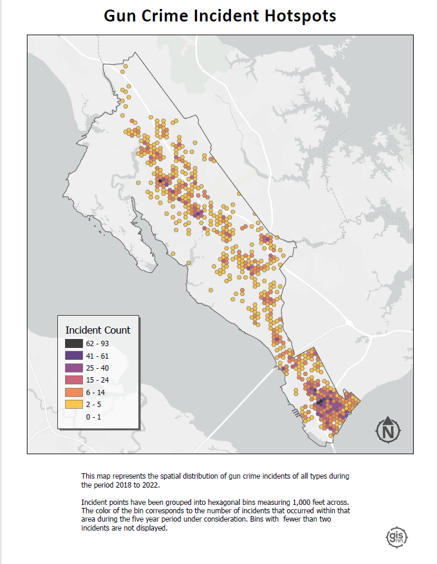

```{=html}
<style>
h1.title {
    font-family: 'Kanit', sans-serif;
    font-weight: 600;
    font-style: normal;
    font-size: 62px;
    letter-spacing: 8px; 
    text-align:center;
}

h2 {
    font-family: 'Kanit', sans-serif;
    font-weight: 500;
    font-style: normal;
}

h3 {
    font-family: 'Kanit', sans-serif;
    font-weight: 380;
    font-style: normal;
}

.text {
      font-family: 'Roboto', sans-serif;
      font-weight: 400;
      font-size: 24px
      letter-spacing: 1.15px;
      text-align:center;
      }
      
.text2 {
      font-family: 'Roboto', sans-serif;
      font-weight: 400;
      font-size: 24px
      letter-spacing: 1.15px;
      }

.row {
  display: flex;
  flex-wrap: wrap; /* Allows items to wrap */
  justify-content: center; /* Centers items horizontally, adjust as needed */
}

.column {
  flex: 1; /* Adjust this to control how columns grow */
  max-width: 45%; /* Maximum width of each column */
  padding: 5px;
  box-sizing: border-box; /* Includes padding in the element's total width and height */
}
</style>
```

<hr>
Below are some examples of my GIS work. They involved some combination of ArcGIS Pro, R, ArcGIS Online, and Python/ArcPy. 
<hr>
<br>

::: {style="text-align: center; font-size: 17px;"}
## eBird life list database

### leveraging PostgreSQL and PostGIS for geospatial data management
:::

<div style="text-align: center; margin-top: 20px; margin-bottom: 15px;">
  <a href="media/Life List Database.png">
    
  </a>
</div>

This was a fun personal project based around my eBird life list. While the project admittedly has an air of data navel-gazing, the real aim was to practice implementing a spatial database using PostgreSQL with PostGIS, host it on a server, and develop a functional application that interacts with the database. I worked out the database structure and schema using dbdiagram.io (see image above). I used R to prepare the data tables that would comprise the database, and utilized the `RPostgres` and `DBI` packages to execute SQL commands from directly within the R environment. I used pgAdmin GUI for setting up an instance on Amazon Web Services RDS, then executed the actual import of the database backup .sql file via the command line. The process was rewarding, as it tested my ability to integrate various tools, methods, and platforms.

To enrich the database and flesh out the tables with additional information, I worked with some cool packages. Specifically, I used `rebird` for accessing eBird data and `openmeteo` to pull in weather data. `rebird` provides some great functionality, but there is no direct way to access individual eBird checklist attributes, some of which I needed (e.g, time, outing duration, total number of species seen). To work around this, I created a custom function to make an API call and return a given checklist's attributes as a list object that could then be picked apart. Another challenge that required some creative problem solving was deriving spatial coordinates for observation locations that weren't tied to recognized hotspots. I took a two-pronged approach, first leveraging regular expressions for extracting coordinates embedded in location names, and then relying on manual data entry for coordinates not available through programmatic means. The project is still ongoing, and when time permits I will work on building out a Shiny application to interact with database.

- <b><a href="portfolio/lifeListDatabase.html" target="blank">documentation for building and deploying the spatial database</a></b>

<br>

<hr>

<br><br> <!-- NEW SECTION -->


::: {style="text-align: center;"}
## colima warbler species range
:::

::: {style="text-align: center;"}
### using spatial landscape variables to better understand distribution
:::

<div style="text-align: center; margin-top: 20px; margin-bottom: 15px;">
  <a href="portfolio/Colima_presentation.pdf">
    
  </a>
</div>

<div class="text2">
<a href="https://www.audubon.org/field-guide/bird/colima-warbler" target="_blank">Colima Warbler</a> (*Leiothlypis crissalis*) is a migratory songbird whose breeding habitat is limited to parts of the rugged, mountainous terrain of Mexico's Sierra Madre Occidental and the Chisos Mountains of Big Bend National Park.
Range maps for this species tend to significantly overstate its extant distribution within the United States.
To get a sense of species' 'official' range, check out the map I created below, based on the distributions recognized by the United States Geological Survey and BirdLife International.

Breeding birds have been shown to inhabit areas dominated by oak, pinyon, juniper, and Arizona cypress, and demonstrate a clear preference for elevations above 1,500 m, with individuals most frequently observed at elevations ≥ 1,800 m.
They employ a ground-nesting strategy and prefers steep (≥35°), north-facing slopes, and sites that are shaded from direct sunlight for 70% of daylight hours.

I used these attributes to derive a model of probable species distribution within the US that radically reduces the area of likely occurrence as compared with the official USGS species range polygon. The project primarily involved raster analysis: deriving slope and aspect from digital elevation models, extracting raster cells based on specified attributes and mask polygons, reclassifying cells to standardized values, and overlaying raster layers to calculte the sum of their cells.
</div>

::: {style="overflow: hidden;"}
<!-- Ensures the container wraps around floated elements -->

<figure style="float: right; margin-left: 20px;">
<!-- Floats the figure to the right and adds space between the text and the image -->

<a href="media/colima_modelbuilder.png" target="_blank"></a>
<figcaption style="text-align: center; width:350px; font-size: .8em;">

<i>ArcGIS Pro model builder workflow for this analysis. Click to enlarge.</i>

</figcaption>


</figure>
<div class="text2">
The final model reduced the area of likely occurrence by *98.24%* as compared with official United States Geological Survey species range polygon.
The results not only highlight the disparities between traditional range maps and the reality of species distribution but also underscored the potential for geospatial analyses to enhance our understanding of species habitats, contributing to more effective conservation strategies.

For a detailed discussion of data sources, methods, and results, <b><a href="portfolio/colima_report.pdf" target="_blank" rel="noopener noreferrer">read my full report</a></b>.
Or check out this <b><a href="portfolio/Colima_presentation.pdf" target="_blank">PDF version</a></b> of a presentation I gave.
</div>
:::

::: row
::: column
<figure>

<a href="media/cowa_range.png" target="_blank">  </a>

<figcaption style="font-size: .82em;">

<br> <i>Colima Warbler range based on BirdLife International’s species range map. </i>

</figcaption>

</figure>
:::

::: column
<figure>

<a href="media/cowa.jpg" target="_blank">  </a>

<figcaption style="font-size: 0.82em;">

<i>Extent of all reported COWA observations within the United States across all years.
Data obtained from eBird and iNaturalist.
Inset map reflects model extent within existing USGS range polygon.</i>

</figcaption>

</figure>
:::
:::


<br>

<hr>

<br><br> <!-- NEW SECTION -->

::: {style="text-align: center;"}
## urban tree inventory

### laying the foundation for a comprehensive tree inventory system
:::

<div style="text-align: center; margin-top: 20px; margin-bottom: 15px;">
  <a href="media/treeInventory.png">
    
  </a>
</div>

While working with the City of Newport News GIS team, I was tasked with developing a tree inventory system that could be used to support the city's sustainability and resource conservation goals and facilitate more efficient and modernized tree care management. The project involved creating a spatial database in ArcGIS Online to manage tree data, building out a Field Maps application for tree data collection, integrating USDA's <a href="https://www.itreetools.org/about">i-Tree Eco</a> workflow for calculating ecosystem benefits, and developing an application using Experience Builder that could be used to explore the city's trees and interact with the collected data. 

In addition to the main 'Trees' point layer, I incorporated a functionally related reference table into the 'City Trees' feature class. When a user selects a common name in the Field Maps app, the app utilizes Arcade expressions to cross-reference the table for a matching common name. It then automatically populates the fields 'species', 'genus', 'functional group', and 'native' within the app based on the retrieved data.

This project gave me the opportunity to leverage Python with ArcGIS PPo Notebooks in order to automate some important data management processes. One Notebook assigns unique tree identifiers to each tree. Every new tree entry in the database is automatically assigned a Global ID, but for day-to-day operations and easier reference, this identifier is not practical. Something shorter and more intuitive was needed. So, instead of a 36 character alphanumeric ID, each tree is assigned a unique ID of the form, e.g., 'NNTREE-10`. I created another Notebook to handle the renaming of fields in the data set returned by i-Tree. The process of getting ecosystem services and benefits calculated by i-Tree involves importing your collected field data and sending it off to the i-Tree web application. The data is then processed and returned as a CSV file. Unfortunately, the returned field names are not consistent with database best practices (e.g., they contain spaces and special characters).The Notebook script ensures that these field names are renamed in accordance with the established tree database schema.

The tree inventory project is still in its nascent stage, and as a result the application I built is not publicly available. But you can see a short video demo of the application below. 

<div style="text-align: center; margin-top: 15px;">
  <video autoplay="autoplay" loop="loop" muted="muted" controls="controls" style="width:675px;">
    <source src="media/treeInventory.mp4" type="video/mp4">
  </video>
</div>

<br>
<hr>

<br><br> <!-- NEW SECTION -->


::: {style="text-align: center;"}
## mapping gun crime

### aggregating urban gun crime incidents to reveal spatial patterns
:::

<div class="text2">
A significant part of my time working with the City of Newport News GIS team involved processing, geocoding, mapping, and analyzing five years (2018-2022) worth of gun crime data as part of the city's Gun Violence Intervention Program.

Given the size and complexity of the data sets received from the Newport News Police Department, a good bit of wrangling was required to prepare them to be mapped and analyzed. Because this project was carried out with the intention of being able to re-run the analysis in the future as new data is receied, I developed a [script in R](portfolio/Script1_InitialDataProcessing.html) to streamline the data preprocessing tasks.
This automation not only facilitated the initial data preparation but also ensured the project's adaptability and longevity.
Once prepared, I utilized ArcGIS Pro for geocoding, mapping, and subsequent analysis.

I employed a variety of analyses and visualization techniques to better understand the spatial patterns underlying gun crime in the city, each of which were used in a presentation to city officials, decision makers and community leaders in the fall of 2023.

-   **Bivariate Choropleth** (Population Density vs. Incident Rate): This map combines two key variables—population density and gun crime incident rate—into a single visualization.
    By doing so, it indicates how the frequency of gun crimes correlates with the concentration of people across different areas.

-   **Hotspots**: This visualization identifies geographical areas with significantly higher occurrences of gun crimes by aggregating points into hexagonal bins 1,000 ft. across.

-   **Hot Streets**: Similar to the hotspots map but more specific.
    This map pinpoints street segments with high frequencies of gun crime.

-   **Victim Binning**: This map displays the spatial distribution of gun crime victims, with victims aggregated into 1,000 x 1,000 foot cells.
    It focuses exclusively on individuals directly affected by gun crime incidents, explicitly excluding victim categories such as 'Business' and 'Government' from the analysis.
    I employed a threshold to enhance clarity and focus, where only cells containing two or more victims are visualized.

<b>Click on a layout below to see it as a high resolution pdf.</b>

::: row
::: column
<a href="portfolio/gvip_bivariate.pdf" target="_blank">  </a>
:::

::: column
<a href="portfolio/gvip_hotspots.pdf" target="_blank">  </a>
:::

::: column
<a href="portfolio/gvip_hotstreets.pdf" target="_blank">  </a>
:::

::: column
<a href="portfolio/gvip_victimAgg.pdf" target="_blank">  </a>
:::
:::

I found the hot streets analysis especially insightful.
By combining the derived gun crime point layer with the city's street centerline layer, I was able to identify street segments with the highest density of gun crime incidents by assigning each point to the nearest feature.

The result?
Of nearly 10,000 street segments that comprise Newport News’ road network fully *80%* of incidents occurred on just over 9% of those segments.
More than a quarter of all incidents took place on fewer than 1% of all segments.
This analysis helped to highlight the spatial concentration of gun crime incidents in the city, and to identify areas where the city's resources might be most effectively deployed
</div>
<br>

<hr>

<br><br> <!-- NEW SECTION -->

::: {style="text-align: center;"}
## saltmarsh sparrow habitat suitability

### identifying potential overwintering habitat for an endangered migratory songbird
:::

<div>

<!-- Ensures the container wraps around floated elements -->

<figure style="float: left; margin-right: 15px; margin-bottom: 3.5px;">

<!-- Floats the figure and adds space between the text and the image -->


<figcaption style="text-align: center; width:150px; font-size: 0.7em;">

<i>Saltmarsh Sparrow (Ammospiza caudacuta) perched on marsh reed.
Photo credit: Mike Kilpatrick</i>

</figcaption>

<!-- Caption under the image -->

</figure>
<div class="text2">
In this project, I carried out an analysis to produce a habitat suitability index (HSI) aimed at identifying potential saltmarsh sparrow winter habitat in southeast Virginia - effectively the southern most extent of their winter range - in areas not already protected under a biodiversity or conservation mandate.

Confronted with the combined effects of sea-level rise and human coastline modification, the saltmarsh sparrow’s continued survival is by no means guaranteed.
The North American Bird Conservation Initiative's <a href="https://www.stateofthebirds.org/2022/" target="_blank">2022 'State of the Birds' report</a> estimates that the species' population has declined by more than *half* since 1970.
The report anticipates a further 50% decline over the next half century.
Similarly, researchers have demonstrated a staggering 9% annual rate of population decline since the mid-1990s.
If that trend continues, they predict a collapse of the global population within 50 years, with as few as 500 individuals left by mid-century.

</div>

These birds demonstrate a strong affinity for high marsh vegetation.
Research on migratory songbirds has demonstrated that occupying inadequate wintering habitat can affect the physical condition of birds during migration, their arrival date on nesting grounds, and their condition at breeding sites.
Working to ensure access to high marsh throughout the entirety of the species’ range is therefore critical.

Generating the HSI required integrating vector and raster data from multiple sources, including the U.S.
Geological Survey (USGS), eBird (Cornell Lab of Ornithology), the Protected Area Database (PAD), and the National Land Cover Database (NLCD). To read the full project report, including a more detailed discussion of analysis methods, <a href="portfolio/finalpaper.pdf" target="_blank" rel="noopener noreferrer"><b>click here</b></a>.
</div>

I created the map below as part of an <a href="https://storymaps.arcgis.com/stories/6c8f3008185b43e89590d5e1939c2379" target="_blank" rel="noopener noreferrer"><b>ArcGIS Story Map</b></a>. It is here embedded as an ArcGIS Instant App. You can also <a href="https://experience.arcgis.com/experience/6dc5922b5abe47ee94fcc056b982d4cf" target="blank">click here</a> to view in full screen as an ArcGIS Experience.

The map represents observations of Saltmarsh Sparrow during the breeding and non-breeding seasons since 2012.
I pulled observation data into R using the eBird API, filtered by year and month, and brought the data into ArcGIS Pro to publish as a feature layer. You can click on the map to view it in full screen


```{=html}
<style>
.embed-container {
  position: relative;
  width: 100%; /* Adjusted from max-width to width and set to 100% */
  padding-bottom: 56.25%; /* This is a common aspect ratio for responsive iframes (16:9). Adjust as necessary for your content */
  height: 0;
}

.embed-container iframe,
.embed-container object,
.embed-container iframe {
  position: absolute;
  top: 0; left: 0;
  width: 100%;
  height: 100%;
}

small {
  position: absolute;
  z-index: 40;
  bottom: 0;
  margin-bottom: -15px;
}
</style>

```
::: embed-container

<iframe src="https://vcu.maps.arcgis.com/apps/instant/basic/index.html?appid=1031f531f57d4b7aa40f6aca05bce18e" width=" 650" height="500" frameborder="0" style="border:0" allowfullscreen>
</iframe>

:::
