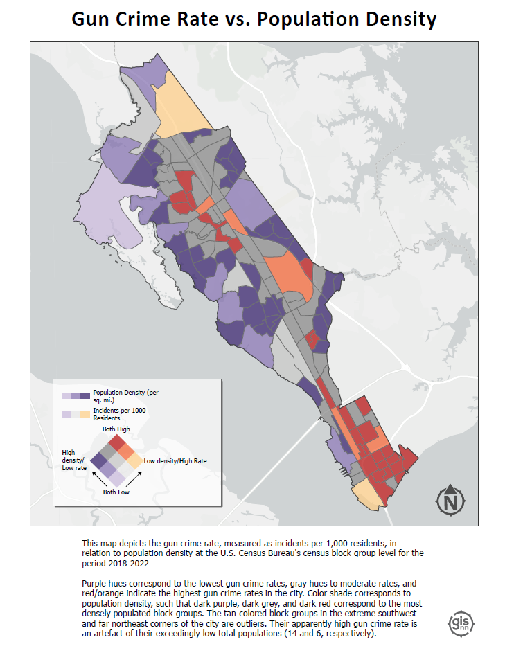

```{=html}
<style>
h1,h2 {
    font-family: 'Caveat', cursive;
    font-weight: 600;
}

.row {
  display: flex;
}

.column {
  flex: 25%;
  padding: 5px;
}
</style>

```
<hr>

<br>

::: {style="text-align: center;"}
# colima warbler species distribution
:::

::: {style="text-align: center; font-size: 17px;"}
using spatial landscape variables to refine the range map of a migratory songbird
:::

[Colima Warbler](https://www.audubon.org/field-guide/bird/colima-warbler) (*Leiothlypis crissalis*) is a migratory songbird whose habitat preference is limited to the rugged, mountainous terrain of Mexico's Sierra Madre Occidental and the Chisos Mountains of Big Bend National Park, Texas.
Range maps for this species tend to significantly overstate its extant distribution within the United States.

Colima Warbler occurrence and nesting location in the Chisos Mountains are highly correlated with four variables: elevation, vegetation, slope of terrain, and aspect (i.e., the cardinal direction in which a slope or land surface faces). I used these attributes to derive a model of probable species distribution. 

Breeding birds inhabit areas dominated by oak, pinyon, juniper, and Arizona cypress, and demonstrate a clear preference for elevations above 1,500 m, with individuals most frequently observed at elevations ≥ 1,800 m. Birds employ a ground-nesting strategy and prefers steep (≥35°), north-facing slopes, and sites that are shaded from direct sunlight for 70% of daylight hours. 

<div style="margin: 0 auto; max-width: 500px;">
```{r, echo = FALSE, message = FALSE, warning= FALSE}
# Create a data frame with the given data
df <- data.frame(
  attribute = c("Elevation", "Vegetation", "Slope", "Aspect"),
  source = c("three 1/3 arc second DEMS, mosaicked together (source: USGS)",
             "10x10m landcover raster (source: Texas Parks and Wildlife Ecological Systems Classification and Mapping Project)",
             "derived from DEM",
             "derived from DEM")
)

# Load the kableExtra library for creating fancy tables
library(kableExtra)

# Create a kable table
kable(df, align = "c", caption = NULL) %>%
  kable_paper() %>%
  kable_styling(bootstrap_options = c("striped", "hover", "condensed")
  )


```

</div>


The resulting model reduced the area of likely occurrence by 98.24% as compared with official United States Geological Survey species range polygon.This analysis not only highlights the disparities between traditional range maps and the reality of species distribution but also underscored the potential for geospatial analyses to enhance our understanding of species habitats, contributing to more effective conservation strategies.


For a more detailed discussion of methods, analysis, and results, <b>[read the full report](portfolio/colima_report.pdf)</b>


::: {style="overflow: auto;"}
<figure style="width: 45.2%; float: left; margin-right: 20px;">


<figcaption style="text-align: center; font-size: 12px; font-style: italic;">

<br>Colima Warbler range based on BirdLife International’s species range map.
[Map and seasonal range polygons produced by the author.]

</figcaption>

</figure>

<figure style="width: 45%; float: left; margin-right: 20px;">


<figcaption style="text-align: center; font-size: 12px; font-style: italic;">

Extent of all reported COWA observations within the United States across all years.
Data obtained from eBird and iNaturalist.
Points do not represent precise latitude and longitude coordinates of observed bird, and in many cases may only be accurate to within \~1km or more.

</figcaption>

</figure>
:::

<br><br><br>
<!-- NEW SECTION -->

::: {style="text-align: center; font-size: 17px;"}
# saltmarsh sparrow habitat suitability

identifying potential overwintering habitat for an endangered migratory songbird
:::

Confronted with the combined effects of sea-level rise and human coastline modification, the saltmarsh sparrow’s continued survival is by no means guaranteed. The North American Bird Conservation Initiative's 'State of the Birds'  report  estimates that the saltmarsh sparrow population has declined by more than half since 1970. The report anticipates a further 50% decline over the next half century. Similarly, researchers have demonstrated a staggering 9% annual rate of population decline since the mid-1990s. If that trend continues, they predict a collapse of the global population within 50 years, with as few as 500 individuals left by mid-century.

Saltmarsh sparrows depend on high marsh. They build their nests there, either directly on the ground or just above it on a mat of cordgrass. Due largely to anthropogenic disturbance, the availability of high marsh habitat is now greatly reduced. That’s bad news for these birds.

While nest building is not a concern during the fall and winter, saltmarsh sparrows nevertheless demonstrate an affinity for high marsh vegetation on their non-breeding grounds. Research on migratory songbirds has demonstrated that occupying inadequate wintering habitat can affect the physical condition of birds during migration, their arrival date on nesting grounds, and their condition at breeding sites. Working to ensure access to high marsh throughout the entirety of the species’ range is therefore critical. 

This analysis aimed to identify potential saltmarsh sparrow winter habitat in southeast Virginia that is not already protected under a biodiversity or conservation mandate.

To read the full project report <b>[click here](portfolio/finalpaper.pdf)</b>.

You can also check out this <b>[ArcGIS Story Map](https://storymaps.arcgis.com/stories/6c8f3008185b43e89590d5e1939c2379)</b> that I made.

<style>.embed-container {position: relative; margin: 0 auto; padding-bottom: 67%; height: 0; max-width: 100%;} .embed-container iframe, .embed-container object, .embed-container iframe{position: absolute; top: 0; left: 0; width: 100%; height: 100%;} small{position: absolute; z-index: 40; bottom: 0; margin-bottom: -15px;}</style><div class="embed-container"><iframe width="300" height="200" frameborder="0" scrolling="no" marginheight="0" marginwidth="0" title="Breeding and overwintering Saltmarsh Sparrow distribution since 2002" src="//vcu.maps.arcgis.com/apps/Embed/index.html?webmap=142964f95f854741a62acb2fac494402&extent=-93.9365,33.0611,-61.4829,46.7376&zoom=true&previewImage=false&scale=true&legend=true&disable_scroll=false&theme=light"></iframe></div>

<br><br><br>
<!-- NEW SECTION -->

::: {style="text-align: center; font-size: 17px;"}
# urban gun crime 

aggregating gun crime incidents to reveal spatial patterns
:::

A signigicant part of my time working as an intern with the City of Newport News GIS team involved wrangling, geocoding, mapping, and analyzing five years worth of gun crime data as part of the city's Gun Violence Intervention Program. 

After applying a variety of analyses and visualizations to the data, I settled on the four maps below as the most effective means of communicating patterns of gun crime in the city. These maps were used in a presentation to city officials and community leaders in the fall of 2023.

Click on an image below to see a high res pdf.

<div class="row">
<div class="column">
 <a href="portfolio/gvip_bivariate.pdf" target="_blank">
  
 </a>
</div>
<div class="column">
  <a href="portfolio/gvip_hotspots.pdf" target="_blank">
  
  </a>
 </div>
<div class="column">
 <a href="portfolio/gvip_hotstreets.pdf" target="_blank">
   
   </a>
</div>
<div class="column">
 <a href="portfolio/gvip_victimAgg.pdf" target="_blank">
  
  </a>
</div>
</div>

