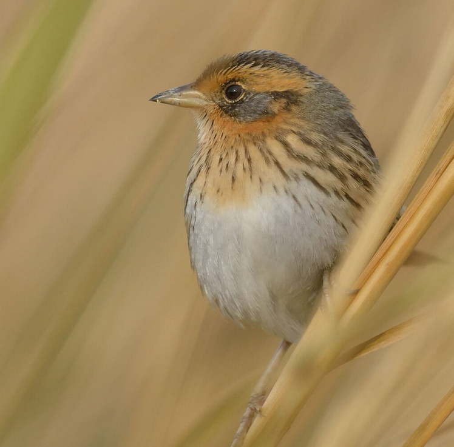

```{=html}
<style>
h1,h2,h3 {
    font-family: 'Caveat', cursive;
    font-weight: 600;
}


.row {
  display: flex;
  flex-wrap: wrap; /* Allows items to wrap */
  justify-content: center; /* Centers items horizontally, adjust as needed */
}

.column {
  flex: 1; /* Adjust this to control how columns grow */
  max-width: 45%; /* Maximum width of each column */
  padding: 5px;
  box-sizing: border-box; /* Includes padding in the element's total width and height */
}
</style>
```
<hr>

<br>

::: {style="text-align: center;"}
# colima warbler species distribution
:::

::: {style="text-align: center;"}
### using spatial landscape variables to refine a species range map
:::

[Colima Warbler](https://www.audubon.org/field-guide/bird/colima-warbler) (*Leiothlypis crissalis*) is a migratory songbird whose habitat preference is limited to the rugged, mountainous terrain of Mexico's Sierra Madre Occidental and the Chisos Mountains of Big Bend National Park, Texas.
Range maps for this species tend to significantly overstate its extant distribution within the United States.
Check out the map I created below, based on the distributions recognized by the United States Geological Survey and BirdLife International, to get a sense of species' 'official' range.

Colima Warbler occurrence and nesting location in the Chisos Mountains are highly correlated with four variables: elevation, vegetation, slope of terrain, and aspect (i.e., the cardinal direction in which a slope or land surface faces).
I used these attributes to derive a model of probable species distribution that radically reduces the area of likely occurrence as compared with the official USGS species range polygon.

Breeding birds inhabit areas dominated by oak, pinyon, juniper, and Arizona cypress, and demonstrate a clear preference for elevations above 1,500 m, with individuals most frequently observed at elevations ≥ 1,800 m.
They employ a ground-nesting strategy and prefers steep (≥35°), north-facing slopes, and sites that are shaded from direct sunlight for 70% of daylight hours.

<div style="overflow: hidden;"> <!-- Ensures the container wraps around floated elements -->
  <figure style="float: right; margin-left: 20px;"> <!-- Floats the figure to the right and adds space between the text and the image -->
  
    </figure>
  
The resulting model reduced the area of likely occurrence by 98.24% as compared with official United States Geological Survey species range polygon.
 
This analysis not only highlights the disparities between traditional range maps and the reality of species distribution but also underscored the potential for geospatial analyses to enhance our understanding of species habitats, contributing to more effective conservation strategies.


For a detailed discussion of data sources, methods, analysis, and results, <b><a href="portfolio/colima_report.pdf" target="_blank" rel="noopener noreferrer">read the full report</a></b>.

</div>

::: row
::: column
<figure>

<a href="media/cowa_range.png" target="_blank">  </a>

<figcaption style="font-size: 0.8em;">
<br>
<i>Colima Warbler range based on BirdLife International’s species range map.</i>

</figcaption>

</figure>
:::

::: column
<figure>

<a href="media/cowa.jpg" target="_blank">  </a>

<figcaption style="font-size: 0.8em;">

<i>Extent of all reported COWA observations within the United States across all years.
Data obtained from eBird and iNaturalist.
Points do not represent precise latitude and longitude coordinates of observed bird, and in many cases may only be accurate to a resolution of \~1km.</i>

</figcaption>

</figure>
:::
:::

<br><br><br> <!-- NEW SECTION -->

::: {style="text-align: center;"}
# saltmarsh sparrow habitat suitability

### identifying potential overwintering habitat for an endangered migratory songbird
:::

<div> <!-- Ensures the container wraps around floated elements -->
  <figure style="float: left; margin-right: 20px;"> <!-- Floats the figure and adds space between the text and the image -->
  
  <figcaption style="text-align: center; width:150px; font-size: 0.7em;"><i>Saltmarsh Sparrow (Ammospiza caudacuta) perched on marsh reed. Photo credit: Mike Kilpatrick</i></figcaption> <!-- Caption under the image -->
    </figure>
    
Confronted with the combined effects of sea-level rise and human coastline modification, the saltmarsh sparrow’s continued survival is by no means guaranteed.
The North American Bird Conservation Initiative's 'State of the Birds' report estimates that the saltmarsh sparrow population has declined by more than half since 1970.
The report anticipates a further 50% decline over the next half century.
Similarly, researchers have demonstrated a staggering 9% annual rate of population decline since the mid-1990s.
If that trend continues, they predict a collapse of the global population within 50 years, with as few as 500 individuals left by mid-century.
</div>

Saltmarsh sparrows depend on high marsh.
They build their nests there, either directly on the ground or just above it on a mat of cordgrass.
Due largely to anthropogenic disturbance, the availability of high marsh habitat is now greatly reduced.
That’s bad news for these birds.

While nest building is not a concern during the fall and winter, saltmarsh sparrows nevertheless demonstrate an affinity for high marsh vegetation on their non-breeding grounds.
Research on migratory songbirds has demonstrated that occupying inadequate wintering habitat can affect the physical condition of birds during migration, their arrival date on nesting grounds, and their condition at breeding sites.
Working to ensure access to high marsh throughout the entirety of the species’ range is therefore critical.

This analysis aimed to identify potential saltmarsh sparrow winter habitat in southeast Virginia - effectively the southern most extent of their winter range - not already protected under a biodiversity or conservation mandate.

I created the map below as part of an <a href="https://storymaps.arcgis.com/stories/6c8f3008185b43e89590d5e1939c2379" target="_blank" rel="noopener noreferrer"><b>ArcGIS Story Map</b></a> that I made for this project.
It represnts observations of Saltmarsh Sparrow during the breeding and non-breeding seasons since 2012.
I pulled observation data into R using the eBird API, filtered by year and month, and wrote out a .csv file which I then brought into ArcGIS Pro to create and publish as a feature layer.

To read the full project report <a href="portfolio/finalpaper.pdf" target="_blank" rel="noopener noreferrer"><b>click here</b></a>.

```{=html}
<style>
.embed-container {
position: relative; 
margin: 0 auto; 
padding-bottom: 67%; 
height: 0; 
max-width: 75%;
} 

.embed-container iframe, 
.embed-container object, 
.embed-container iframe{
position: absolute; 
top: 0; left: 0; 
width: 100%; 
height: 100%;
} 

small{
position: absolute; 
z-index: 40; 
bottom: 0; 
margin-bottom: -15px;
}
</style>
```
::: embed-container
<iframe width="300" height="200" frameborder="0" scrolling="no" marginheight="0" marginwidth="0" title="Breeding and overwintering Saltmarsh Sparrow distribution since 2002" src="//vcu.maps.arcgis.com/apps/Embed/index.html?webmap=142964f95f854741a62acb2fac494402&amp;extent=-93.9365,33.0611,-61.4829,46.7376&amp;zoom=true&amp;previewImage=false&amp;scale=true&amp;legend=true&amp;disable_scroll=false&amp;theme=light">

</iframe>
:::

<br><br><br> <!-- NEW SECTION -->

::: {style="text-align: center;"}
# urban gun crime

### aggregating gun crime incidents to reveal spatial patterns
:::

A signigicant part of my time working as an intern with the City of Newport News GIS team involved wrangling, geocoding, mapping, and analyzing five years worth of gun crime data as part of the city's Gun Violence Intervention Program.

After applying a variety of analyses and visualizations to the data, I settled on the four maps below as the most effective means of communicating patterns of gun crime in the city.
These maps were used in a presentation to city officials and community leaders in the fall of 2023.

I found the hot streets analysis especially insightful. Using the gun crime point layer combined with our city's street centerline layer, I was able to identify the streets with the highest density of gun crime incidents by aggregating each point to the nearest street. The result? Of nearly 10,000 street segments that comprise Newport News’ road network fully *80%* of gun crime incidents during the period 2018-2022 occurred on just over 9% of those segments. More than a quarter of all incidents took place on fewer than 1% of all segments. This analysis really helped to highlight the spatial concentration of gun crime incidents in the city, and to identify areas where the city's resources might be most effectively deployed

Click on a layout below to see it as a high resolution pdf.

::: row
::: column
<a href="portfolio/gvip_bivariate.pdf" target="_blank">  </a>
:::

::: column
<a href="portfolio/gvip_hotspots.pdf" target="_blank">  </a>
:::

::: column
<a href="portfolio/gvip_hotstreets.pdf" target="_blank">  </a>
:::

::: column
<a href="portfolio/gvip_victimAgg.pdf" target="_blank">  </a>
:::
:::

<br><br><br> <!-- NEW SECTION -->

::: {style="text-align: center; font-size: 17px;"}
# avian diversity in grassland vs forest ecosystems

### class-level landscape metrics as predictors of avian species richness
:::

For this analysis, completed as my final project for landscape ecology (ENVS 591) during the fall of 2023 at VCU, I was interested in exploring the extent to which class-level landscape metrics differ in their ability to explain variation in avian species richness (total # of different species) in grassland ecosystems versus forest ecosystems. This project gave me a chance to work with data sets from the National Ecology Observatory Network (NEON), a comprehensive ecological monitoring program that collects standardized, high-quality data from diverse ecosystems across the United States. Check out the map below - which I made using the `mapview` package in R -  to see the NEON sites used in my analysis.


```{r, warning=FALSE, message = FALSE, echo = FALSE}
library(dplyr)

source("other/le_script.R")

# Bring together primary point layers for each study area
plots <- rbind(bland_final, serc_final, smith_final,kona_final, konz_final, kans_final)


plots <- plots %>%
  mutate(studyarea = case_when(
    grepl("KONA", substr(plotYear, 1, 4)) ~ "Konza Prairie Agroecosystem",
    grepl("KONZ", substr(plotYear, 1, 4)) ~ "Konza Prairie Biological Station",
    grepl("UKFS", substr(plotYear, 1, 4)) ~ "University of Kansas Field Station",
    grepl("BLAN", substr(plotYear, 1, 4)) ~ "Blandy Experimental Forest",
    grepl("SCBI", substr(plotYear, 1, 4)) ~ "Smithsonian Conservation Bio. Inst.",
    grepl("SERC", substr(plotYear, 1, 4)) ~ "Smithsonian Experimental Research Center",
    TRUE ~ NA
  ))

plots$studyarea <- as.factor(plots$studyarea) # Make factor for zcol=
plots$studyarea <- factor(plots$studyarea, 
                          as.character(unique(plots$studyarea)))


plots.sf <- sf::st_as_sf(plots, crs = 4326, coords = c("decimalLongitude", "decimalLatitude"))

mapview::mapview(plots.sf, zcol = "studyarea", 
        layer.name = "NEON Study Areas", 
        map.types="OpenStreetMap",
        width = 300,
        height = 200)

plots %>%
  group_by(studyarea) %>%
  summarize(x = n())

```

<br>
My analysis used three years of data (2019-2021) from three separate study areas in each of the two landscape types. Each study area comprised
