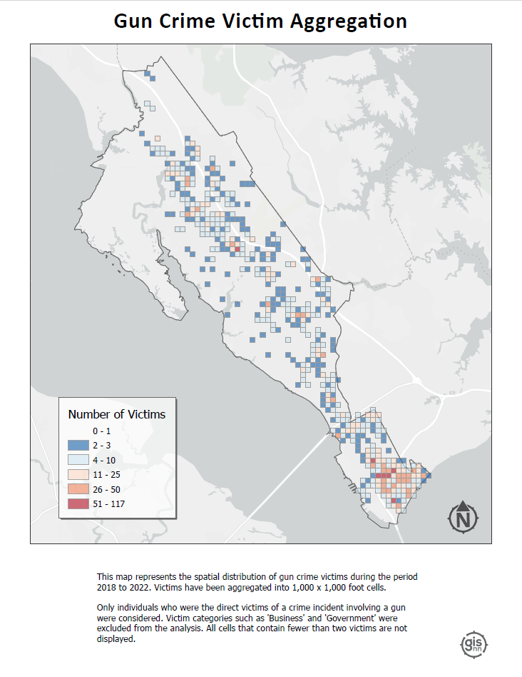

```{=html}
<style>
h1.title {
    font-family: 'Kanit', sans-serif;
    font-weight: 600;
    font-style: normal;
    font-size: 70px;
    letter-spacing: 2px; 
    text-align:center;
}

h2 {
    font-family: 'Kanit', sans-serif;
    font-weight: 500;
    font-style: normal;
}

h3 {
    font-family: 'Kanit', sans-serif;
    font-weight: 380;
    font-style: normal;
}


.row {
  display: flex;
  flex-wrap: wrap; /* Allows items to wrap */
  justify-content: center; /* Centers items horizontally, adjust as needed */
}

.column {
  flex: 1; /* Adjust this to control how columns grow */
  max-width: 45%; /* Maximum width of each column */
  padding: 5px;
  box-sizing: border-box; /* Includes padding in the element's total width and height */
}
</style>
```
<br> <i>Here you can check out some of my geospatial analysis projects.

What you see below was carried out using some combination of ArcGIS Pro and R.
The R language and RStudio interface have become essential parts of my GIS workflows - particularly when it comes to data exploration, wrangling, manipulation, and generating dynamic reports.
The functionality of the</i> `arcbisbridge` <i>package allows for (relatively) seamless communication between the two programs.
</i>

<hr>

<br>

::: {style="text-align: center;"}
## colima warbler species range
:::

::: {style="text-align: center;"}
### using spatial landscape variables to better understand distribution
:::

<div style="text-align: center; margin-top: 0; margin-bottom: 15px;">
  <a href="portfolio/colima_report.pdf">
    
  </a>
</div>


[Colima Warbler](https://www.audubon.org/field-guide/bird/colima-warbler) (*Leiothlypis crissalis*) is a migratory songbird whose habitat preference is limited to the rugged, mountainous terrain of Mexico's Sierra Madre Occidental and the Chisos Mountains of Big Bend National Park, Texas.
Range maps for this species tend to significantly overstate its extant distribution within the United States.
To get a sense of species' 'official' range, check out the map I created below, based on the distributions recognized by the United States Geological Survey and BirdLife International.

Breeding birds inhabit areas dominated by oak, pinyon, juniper, and Arizona cypress, and demonstrate a clear preference for elevations above 1,500 m, with individuals most frequently observed at elevations ≥ 1,800 m.
They employ a ground-nesting strategy and prefers steep (≥35°), north-facing slopes, and sites that are shaded from direct sunlight for 70% of daylight hours.
I used these attributes to derive a model of probable species distribution within United States that radically reduces the area of likely occurrence as compared with the official USGS species range polygon.

::: {style="overflow: hidden;"}
<!-- Ensures the container wraps around floated elements -->

<figure style="float: right; margin-left: 20px;">

<!-- Floats the figure to the right and adds space between the text and the image -->


</figure>

The final model reduced the area of likely occurrence by 98.24% as compared with official United States Geological Survey species range polygon.
The results not only highlight the disparities between traditional range maps and the reality of species distribution but also underscored the potential for geospatial analyses to enhance our understanding of species habitats, contributing to more effective conservation strategies.

I carried out this analysis using a combination of both ArcGIS Pro and R.

For a detailed discussion of data sources, methods, and results, <b><a href="portfolio/colima_report.pdf" target="_blank" rel="noopener noreferrer">read the full report</a></b>.
:::

::: row
::: column
<figure>

<a href="media/cowa_range.png" target="_blank">  </a>

<figcaption style="font-size: 0.8em;">

<br> <i>Colima Warbler range based on BirdLife International’s species range map.</i>

</figcaption>

</figure>
:::

::: column
<figure>

<a href="media/cowa.jpg" target="_blank">  </a>

<figcaption style="font-size: 0.8em;">

<i>Extent of all reported COWA observations within the United States across all years.
Data obtained from eBird and iNaturalist.
Points do not represent precise latitude and longitude coordinates of observed bird, and in many cases may only be accurate to a resolution of \~1km.</i>

</figcaption>

</figure>
:::
:::

<br>

<hr>

<br><br> <!-- NEW SECTION -->

::: {style="text-align: center;"}
## saltmarsh sparrow habitat suitability

### identifying potential overwintering habitat for an endangered migratory songbird
:::

<div>

<!-- Ensures the container wraps around floated elements -->

<figure style="float: left; margin-right: 15px; margin-bottom: 8px;">

<!-- Floats the figure and adds space between the text and the image -->


<figcaption style="text-align: center; width:150px; font-size: 0.7em;">

<i>Saltmarsh Sparrow (Ammospiza caudacuta) perched on marsh reed.
Photo credit: Mike Kilpatrick</i>

</figcaption>

<!-- Caption under the image -->

</figure>

In this project, I carried out an analysis to produce a habitat suitability index (HSI) aimed at identifying potential saltmarsh sparrow winter habitat in southeast Virginia - effectively the southern most extent of their winter range - in areas not already protected under a biodiversity or conservation mandate.

Confronted with the combined effects of sea-level rise and human coastline modification, the saltmarsh sparrow’s continued survival is by no means guaranteed.
The North American Bird Conservation Initiative's [2022 'State of the Birds' report](https://www.stateofthebirds.org/2022/) estimates that the species' population has declined by more than *half* since 1970.
The report anticipates a further 50% decline over the next half century.
Similarly, researchers have demonstrated a staggering 9% annual rate of population decline since the mid-1990s.
If that trend continues, they predict a collapse of the global population within 50 years, with as few as 500 individuals left by mid-century.

</div>

These birds demonstrate a strong affinity for high marsh vegetation.
Research on migratory songbirds has demonstrated that occupying inadequate wintering habitat can affect the physical condition of birds during migration, their arrival date on nesting grounds, and their condition at breeding sites.
Working to ensure access to high marsh throughout the entirety of the species’ range is therefore critical.

Generating the HSI required integrating vector and raster data from multiple sources, including the U.S.
Geological Survey (USGS), eBird (Cornell Lab of Ornithology), the Protected Area Database (PAD), and the National Land Cover Database (NLCD).

I created the map below as part of an <a href="https://storymaps.arcgis.com/stories/6c8f3008185b43e89590d5e1939c2379" target="_blank" rel="noopener noreferrer"><b>ArcGIS Story Map</b></a>.
It represents observations of Saltmarsh Sparrow during the breeding and non-breeding seasons since 2012.
I pulled observation data into R using the eBird API, filtered by year and month, and brought the data into ArcGIS Pro to publish as a feature layer.

To read the full project report, including a more detailed discussion of analysis methods, <a href="portfolio/finalpaper.pdf" target="_blank" rel="noopener noreferrer"><b>click here</b></a>.

```{=html}
<style>
.embed-container {
position: relative; 
margin: 0 auto; 
padding-bottom: 67%; 
height: 0; 
max-width: 75%;
} 

.embed-container iframe, 
.embed-container object, 
.embed-container iframe{
position: absolute; 
top: 0; left: 0; 
width: 100%; 
height: 100%;
} 

small{
position: absolute; 
z-index: 40; 
bottom: 0; 
margin-bottom: -15px;
}
</style>
```
::: embed-container
<iframe width="300" height="200" frameborder="0" scrolling="no" marginheight="0" marginwidth="0" title="Breeding and overwintering Saltmarsh Sparrow distribution since 2002" src="//vcu.maps.arcgis.com/apps/Embed/index.html?webmap=142964f95f854741a62acb2fac494402&amp;extent=-93.9365,33.0611,-61.4829,46.7376&amp;zoom=true&amp;previewImage=false&amp;scale=true&amp;legend=true&amp;disable_scroll=false&amp;theme=light">

</iframe>
:::

<br>

<hr>

<br><br> <!-- NEW SECTION -->

::: {style="text-align: center;"}
## urban gun crime

### aggregating gun crime incidents to reveal spatial patterns
:::

A significant part of my time working as an intern with the City of Newport News GIS team involved wrangling, geocoding, mapping, and analyzing five years worth of gun crime data as part of the city's Gun Violence Intervention Program.

Given the size and complexity of the gun crime data received from the Newport News Police Department, a significant amount of wrangling was required to prepare the data to be mapped and analyzed.
Additionally, this project was carried out with the intention of being able to re-run the analysis in the future as more data become available.
To facilitate this, I developed a [script in R](linktoscript) to streamline the data preprocessing tasks.
This automation not only facilitated the initial analysis but also ensured the project's adaptability and longevity.
Following the data preparation, I utilized ArcGIS Pro for geocoding, mapping, and further analysis, setting a foundation for dynamic and ongoing exploration of gun crime patterns.

A variety of analyses and visualization techniques were employed to better understand the spatial patterns underlying gun crime in the city, each of which were presented to city officials, decision makers and community leaders in the fall of 2023.

-   **Bivariate Choropleth** (Population Density vs. Incident Rate): This map combines two key variables—population density and gun crime incident rate—into a single visualization.
    By doing so, it indicates how the frequency of gun crimes correlates with the concentration of people across different areas.

-   **Hotspots**: This visualization identifies geographical areas with significantly higher occurrences of gun crimes by aggregating points into hexagonal bins 1,000 ft. across.

-   **Hot Streets**: Similar to the hotspots map but more specific.
    This map pinpoints street segments with high frequencies of gun crime.

-   **Victim Binning**: This map displays the spatial distribution of gun crime victims, with victims aggregated into 1,000 x 1,000 foot cells.
    It focuses exclusively on individuals directly affected by gun crime incidents, explicitly excluding victim categories such as 'Business' and 'Government' from the analysis.
    I employed a threshold to enhance clarity and focus, where only cells containing two or more victims are visualized.

<b>Click on a layout below to see it as a high resolution pdf.</b>

::: row
::: column
<a href="portfolio/gvip_bivariate.pdf" target="_blank">  </a>
:::

::: column
<a href="portfolio/gvip_hotspots.pdf" target="_blank">  </a>
:::

::: column
<a href="portfolio/gvip_hotstreets.pdf" target="_blank">  </a>
:::

::: column
<a href="portfolio/gvip_victimAgg.pdf" target="_blank">  </a>
:::
:::

I found the hot streets analysis especially insightful.
Using the gun crime point layer combined with our city's street centerline layer, I was able to identify the streets with the highest density of gun crime incidents by aggregating each point to the nearest street.
The result?
Of nearly 10,000 street segments that comprise Newport News’ road network fully *80%* of gun crime incidents during the period 2018-2022 occurred on just over 9% of those segments.
More than a quarter of all incidents took place on fewer than 1% of all segments.
This analysis really helped to highlight the spatial concentration of gun crime incidents in the city, and to identify areas where the city's resources might be most effectively deployed

<br>

<hr>

<br><br> <!-- NEW SECTION -->

::: {style="text-align: center; font-size: 17px;"}
## bird diversity in grassland vs forest ecosystems

### class-level landscape metrics as predictors of avian species richness
:::

For this analysis, completed as my final project for landscape ecology (ENVS 591) during the fall of 2023 at VCU, I was interested in exploring the extent to which class-level landscape metrics differ in their ability to explain variation in avian species richness (total \# of different species) in grassland ecosystems versus forest ecosystems.

The whole project was carried out using **R** in RStudio, and was a great opportunity to learn how to conduct a spatial analysis outside of a point-and-click GIS environment.
It allowed me to become familiar with a number of great spatial R packages and APIs, including `mapview`, `terra`, `sf`, `raster`, `FedData`, and `landscapemetrics`.

This project gave me a chance to work with data sets from the National Ecology Observatory Network (NEON), a comprehensive ecological monitoring program that collects standardized, high-quality data from diverse ecosystems across the United States.
Check out the maps below - which I made using the `mapview` package in R - to see the NEON sites used in my analysis.

```{r, warning=FALSE, message = FALSE, echo = FALSE}
library(dplyr)

source("other/le_script.R")

# Bring together primary point layers for each study area
plots <- rbind(bland_final, serc_final, smith_final,kona_final, konz_final, kans_final)


plots <- plots %>%
  mutate(studyarea = case_when(
    grepl("KONA", substr(plotYear, 1, 4)) ~ "Konza Prairie Agroecosystem",
    grepl("KONZ", substr(plotYear, 1, 4)) ~ "Konza Prairie Biological Station",
    grepl("UKFS", substr(plotYear, 1, 4)) ~ "University of Kansas Field Station",
    grepl("BLAN", substr(plotYear, 1, 4)) ~ "Blandy Experimental Forest",
    grepl("SCBI", substr(plotYear, 1, 4)) ~ "Smithsonian Conservation Bio. Inst.",
    grepl("SERC", substr(plotYear, 1, 4)) ~ "Smithsonian Experimental Research Center",
    TRUE ~ NA
  ))

plots$studyarea <- as.factor(plots$studyarea) # Make factor for zcol=
plots$studyarea <- factor(plots$studyarea, 
                          as.character(unique(plots$studyarea)))


plots.sf <- sf::st_as_sf(plots, crs = 4326, coords = c("decimalLongitude", "decimalLatitude"))

labels_df <- data.frame(
  studyarea = c("GRASSLAND SITES", "FOREST SITES"),
  decimalLongitude = c(-96.49, -79),
  decimalLatitude = c(40, 36.68)     
)

# Convert to sf object
labels_sf <- sf::st_as_sf(labels_df, coords = c("decimalLongitude", "decimalLatitude"), crs = 4326)

# Create maps for each ecosystem type -- must reset the factor levels. This was easier than typing the entire study area name
forest <- plots.sf[grepl("Bland|Smith", plots.sf$studyarea),]
forest$studyarea <- as.character(forest$studyarea)
forest$studyarea <- as.factor(forest$studyarea)
grassland <- plots.sf[grepl("Konz|Kans", plots.sf$studyarea),]
grassland$studyarea <- as.character(grassland$studyarea)
grassland$studyarea <- as.factor(grassland$studyarea)
```

::: row
::: col-md-6
```{r, fig.height = 4, fig.width = 4, echo = FALSE}
mapview::mapview(
  forest, 
  zcol = "studyarea", 
  cex = 3.5,
  layer.name = "Forest Study Sites", 
  map.types = "OpenStreetMap", 
  col.regions = c("#ED6A5E", "#E9D985", "#007991")
)
```
:::

::: col-md-6
```{r, fig.height = 4, fig.width = 4, echo= FALSE}

mapview::mapview(
  grassland, 
  zcol = "studyarea", 
  cex = 3.5,
  layer.name = "Grassland Study Sites", 
  map.types = "OpenStreetMap",
  col.regions = c("blue3", "salmon2", "aquamarine3")
  )

```
:::
:::

<br>

Working outside of the ArcGIS Pro environment - and therefore not enjoying the convenience of 'on-the-fly projection' - required me to be especially attentive to coordinate reference systems and projections as I prepared spatial data from different sources for analysis.

My analysis used three years of data (2019-2021) from three separate study areas in each of the two landscape types.
Study areas comprised 10-20 distinct study plots, with each 'plot-year' combination representing a unique sampling event (n=228).
For each plot-year combination, I calculated the total number of bird species observed.
I pulled in National Land Cover Data using `FedData` and generated buffers around each plot-year at 200m, 500m, 1000m, and 2000m in order to assess the influence of landscape metrics at different spatial scales.

Before calculating landscape metrics I first reclassified the NLCD data using a reclassification matrix to produce new raster datasets with simplified land cover categories (forest, agricultural, and urban).
I then used the `landscapemetrics` package to calculate 5 different class-level landscape metrics for each buffer size:


| <b>Metric</b>                          | <b>Description</b>                                                                                                                          |
|--------------------|----------------------------------------------------|
| Proportion of Landscape (PLAND) | Measures the percentage of the landscape covered by a specific land cover class.                                                     |
| Largest Patch Index (LPI)       | Measures the dominance of the largest patch of a particular land cover class.                                                        |
| Aggregation Index (AI)          | Measures the degree to which a land cover class is aggregated or dispersed in the landscape.                                         |
| Mean Patch Size                 | Represents the average size of patches for a given land cover type.                                                                  |
| Mean Core Area Size             | Represents the average size of the core areas (interior parts of patches, excluding edges) of land cover class for given cover type. |

<div style="text-align: center; margin-top: 17px; margin-bottom: 21px;">
  <figcaption style="text-align: center; font-size: .87em;">
    <i>Data preprocessing R workflow</i>
  </figcaption>
  
</div>


Five landscape metrics and four buffer sizes produced a total of 20 variables to be considered as potential predictors of species richness in each ecosystem type. Given time constraints, I took a bit of a shortcut to select variables for modelling. I utilized a tiered hierarchical approach, such that minimally correlated variables were first selected at each spatial extent and those selected variables were then further evaluated together to make a final selection (I did this using the `corSelect()` function from the `fuzzySim` (v. 4.10.5). While this approach was pragmatic, I would like to eventually return to this analysis and better integrate domain-specific ecological knowledge to tailor variable selection more closely to the specific questions and hypotheses of the project.

With variables selected, I initially applied a generalized linear mixed model approach to incorporate study area as a random effect. This produced a 'singular fit', however, indicating that the model was overfitted -- that is, the random effects structure was too complex to be supported by the data. Instead, I utilized multiple regression to fit models for every possible combination of predictor variable then compared models using AIC to select the top performers. 

<b>tl;dr version</b> 

* In mid-Atlantic forests, only elevation and % forest cover were found to be significant predictors of avian species richness. 
* In grasslands, both PLAND at 1000m and AI at 1000m were found to be significant predictors.
* Significantly higher amount of variation in avian species richness explained by grassland model (42.6%) than forest models (<12%).

Here's a <b>[PDF version of a presentation](portfolio/le.final.pdf)</b> I gave where you can take a more detailed look at some of the results.


