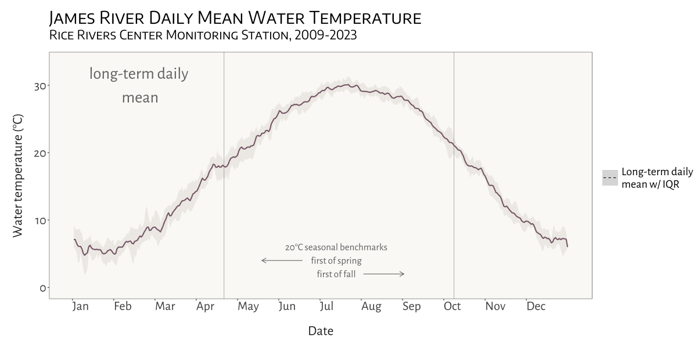
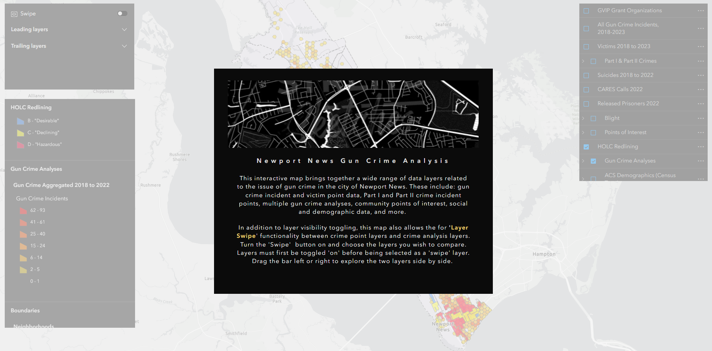

```{=html}
<style>
h1.title {
    font-family: 'Kanit', sans-serif;
    font-weight: 600;
    font-style: normal;
    font-size: 62px;
    letter-spacing: 8px; 
    text-align:center;
}

h2 {
    font-family: 'Kanit', sans-serif;
    font-weight: 500;
    font-style: normal;
}

h3 {
    font-family: 'Kanit', sans-serif;
    font-weight: 380;
    font-style: normal;
}

.text {
      font-family: 'Roboto', sans-serif;
      font-weight: 400;
      font-size: 24px
      letter-spacing: 1.15px;
      text-align:center;
      }
      
.text2 {
      font-family: 'Roboto', sans-serif;
      font-weight: 400;
      font-size: 24px
      letter-spacing: 1.15px;
      }

.row {
  display: flex;
  flex-wrap: wrap; /* Allows items to wrap */
  justify-content: center; /* Centers items horizontally, adjust as needed */
}

.column {
  flex: 1; /* Adjust this to control how columns grow */
  max-width: 45%; /* Maximum width of each column */
  padding: 5px;
  box-sizing: border-box; /* Includes padding in the element's total width and height */
}
</style>
```

<hr>
Below are various projects, both professional and academic, that highlight in one way or another my skills in geospatial and data analysis, coding, research, and writing. As you may notice, I make heavy use of R in most, if not all, of my projects and workflows. It's an incredibly powerful tool!
<hr>

<br>

::: {style="text-align: center;"}
## "mapping a greener future"
:::

<div style="text-align: center; margin-top: 20px; margin-bottom: 15px;">
<a href="media/webapp_demo.gif" target="blank"></a>
</div>

I'm pleased to say that a brief article I was the lead author on has been published in <i>Urban Agriculture Magazine</i>, a publication of the <a href="https://www.ruaf.org/" target="_blank">Resource Centres on Urban Agriculture and Food Security</a>. The article, titled "Mapping a greener future: how GIS enhances urban agriculture initiatives", appears in issue no. 41, released in July of 2024. The article is a summary of the work I am a part of as a member of the Urban Land and Site Assessment (uLESA) research team at VCU that is working to enhance empiricism and intentional planning around site selection for urban agriculture initiatives. The article discusses the critical role of GIS in identifying optimal locations for in-ground urban agriculture projects, the development of web applications for decision-making, and the importance of social equity and sustainability in these initiatives. 

The above gif is a quick demo of the application I developed using ArcGIS Experience Builder as a deliverable for the Richmond uLESA project. The app allows users to explore the city of Richmond, VA in conjunction with various data layers, including the Richmond uLESA model output, which highlights optimal sites for urban agriculture based on a number of geographic, environmental, and social equity-focused variables, the city's parcel layer, existing community gardens, neighborhood boundaries, and council districts. 


- <b><a href="portfolio/urban-agriculture-magazine-41.pdf" target="blank">pdf of Urban Agriculture Magazine no. 41</a></b>

<br>
<hr>

<br><br> 
<!-- NEW SECTION -->


::: {style="text-align: center;"}
## climate change effects on Virginia reservoirs
:::

<div style="text-align: center; margin-top: 20px; margin-bottom: 15px;">
<a href="media/animatedplot.gif" target="blank"></a>
</div>


My most recent project for the Bukaveckas Lab at VCU involved analyzing the effects of climate change on Virginia reservoirs. Between February and July of 2024 I contributed to a forthcoming peer-reviewed publication that examines the effects of climate change on reservoirs throughout Virginia. This involved carrying out median-based linear modeling (MBLM) to assess long-term trends in temperature and dissolved oxygen at 41 lake stations across the state. MBLM was selected for its robustness to outliers, which ensured more reliable results in the presence of  irregular data points, occurring either as a result of extreme weather conditions or instrument error. The analysis was based on a large data set from Virginia Department of Environmental Quality  comprising ~19,00 profiles from over 500 stations across more than 100 reservoirs in the state. The stations selected for the study were chosen based on their having at least 100 profiles available for analysis. For each station, month-by-month trends from May to October were calculated, along with intra-annual trends focusing on the period from April to August each year.

I really enjoyed this project, not only because it gave me a chance to learn about and apply a new statistical method in the context of valuable climate-focused research, but because it presented me with some opportunities for data visualization and applying my GIS and spatial analysis chops. Exploratory analysis involved, among other things, testing various environmental factors, such as latitude, longitude, to uncover potential spatial gradients and temporal patterns that might explain variability in the data. I had a rewarding - if rather challenging - experience trying to create a plot, using our data, based on a figure from another publication. This involved some pretty advanced `ggplot2` concepts to achieve the desired formatting and layout. Plus, I got to make a cool map (!) for publication that shows the locations of the trend analysis sites and the watersheds they are located in. This gave me a chance to try to develop a compelling color scheme and layout that was be both visually appealing and informative.

All in all, this project is built on quite a few Markdown files. Below are a couple of examples.


- <b><a href="portfolio/DOMin_Mean_Range_trends.html" target="blank">source code for deriving DO trends and producing corresponding box-whisker plots</a></b>
- <b><a href="portfolio/longTermAnnualTrends_AprtoAug.html" target="blank">source code for deriving Apr to Aug site trends + generating plot</a></b>

<br>
<hr>

<br><br> 
<!-- NEW SECTION -->

::: {style="text-align: center; font-size: 17px;"}
## eBird life list database

### leveraging PostgreSQL and PostGIS for geospatial data management
:::

<div style="text-align: center; margin-top: 20px; margin-bottom: 15px;">
  <a href="media/Life List Database.png">
    
  </a>
</div>

This was a fun personal project based around my eBird life list. While the project admittedly has an air of data navel-gazing, my goal was to practice implementing a spatial database using PostgreSQL with PostGIS, host it on a server, and develop a functional application that interacts with the database. 

I first worked out the database structure and schema using dbdiagram.io (see image above). I then used R to prepare the data tables that would make up the database and utilized the `RPostgres` and `DBI` packages to execute SQL commands directly within the R environment. I made use of the pgAdmin GUI for setting up an instance on Amazon Web Services RDS, then executed the actual import of the database backup .sql file via the command line. The process was a bit of a challenge, but rewarding, as it tested my ability to integrate various tools, methods, and platforms.

To enrich the database and flesh out the tables with additional information, I worked with some cool packages in R. Specifically, I used `rebird` for accessing eBird data and `openmeteo` to pull in weather data. `rebird` provides some great functionality, but there is no direct way to access individual eBird checklist attributes, some of which I needed (e.g, time, outing duration, total number of species seen) in order to achieve my desired database schema. To work around this, I created a custom function to make an API call and return a given checklist's attributes as a list object that could be teased apart. Another challenge that required some creative problem solving was deriving spatial coordinates from observation locations that weren't tied to recognized hotspots. I took a two-pronged approach, first leveraging regular expressions for extracting coordinates embedded in location names, and then relying on manual data entry for coordinates not available through programmatic means. The project is still ongoing, and when time permits I will work on building out a Shiny application to interact with database.

- <b><a href="portfolio/lifeListDatabase.html" target="blank">documentation for building and deploying the spatial database</a></b>

<br>

<hr>

<br><br> <!-- NEW SECTION -->


::: {style="text-align: center;"}
## colima warbler species range
:::

::: {style="text-align: center;"}
### using spatial landscape variables to better understand distribution
:::

<div style="text-align: center; margin-top: 20px; margin-bottom: 15px;">
  <a href="portfolio/Colima_presentation.pdf">
    
  </a>
</div>

<div class="text2">
<a href="https://www.audubon.org/field-guide/bird/colima-warbler" target="_blank">Colima Warbler</a> (*Leiothlypis crissalis*) is a migratory songbird whose breeding habitat is limited to parts of the rugged, mountainous terrain of Mexico's Sierra Madre Occidental and the Chisos Mountains of Big Bend National Park.
Range maps for this species tend to significantly overstate its extant distribution within the United States.
To get a sense of species' 'official' range, check out the map I created below, based on the distributions recognized by the United States Geological Survey and BirdLife International.

Breeding birds have been shown to inhabit areas dominated by oak, pinyon, juniper, and Arizona cypress, and demonstrate a clear preference for elevations above 1,500 m, with individuals most frequently observed at elevations ≥ 1,800 m.
They employ a ground-nesting strategy and prefers steep (≥35°), north-facing slopes, and sites that are shaded from direct sunlight for 70% of daylight hours.

I used these attributes to derive a model of probable species distribution within the US that radically reduces the area of likely occurrence as compared with the official USGS species range polygon. The project primarily involved raster analysis: deriving slope and aspect from digital elevation models, extracting raster cells based on specified attributes and mask polygons, reclassifying cells to standardized values, and overlaying raster layers to calculte the sum of their cells.
</div>

::: {style="overflow: hidden;"}
<!-- Ensures the container wraps around floated elements -->

<figure style="float: right; margin-left: 20px;">
<!-- Floats the figure to the right and adds space between the text and the image -->

<a href="media/colima_modelbuilder.png" target="_blank"></a>
<figcaption style="text-align: center; width:350px; font-size: .8em;">

<i>ArcGIS Pro model builder workflow for this analysis. Click to enlarge.</i>

</figcaption>


</figure>
<div class="text2">
The final model reduced the area of likely occurrence by *98.24%* as compared with official United States Geological Survey species range polygon.
The results not only highlight the disparities between traditional range maps and the reality of species distribution but also underscored the potential for geospatial analyses to enhance our understanding of species habitats, contributing to more effective conservation strategies.

For a detailed discussion of data sources, methods, and results, <b><a href="portfolio/colima_report.pdf" target="_blank" rel="noopener noreferrer">read my full report</a></b>.
Or check out this <b><a href="portfolio/Colima_presentation.pdf" target="_blank">PDF version</a></b> of a presentation I gave.
</div>
:::

::: row
::: column
<figure>

<a href="media/cowa_range.png" target="_blank">  </a>

<figcaption style="font-size: .82em;">

<br> <i>Colima Warbler range based on BirdLife International’s species range map. </i>

</figcaption>

</figure>
:::

::: column
<figure>

<a href="media/cowa.jpg" target="_blank">  </a>

<figcaption style="font-size: 0.82em;">

<i>Extent of all reported COWA observations within the United States across all years.
Data obtained from eBird and iNaturalist.
Inset map reflects model extent within existing USGS range polygon.</i>

</figcaption>

</figure>
:::
:::


<br>

<hr>

<br><br> <!-- NEW SECTION -->

::: {style="text-align: center;"}
## urban tree inventory

### laying the foundation for a comprehensive tree inventory system
:::

<div style="text-align: center; margin-top: 20px; margin-bottom: 15px;">
  <a href="media/treeInventory.png">
    
  </a>
</div>

While working with the City of Newport News GIS team, I was tasked with developing a tree inventory system that could be used to support the city's sustainability and resource conservation goals and facilitate more efficient and modernized tree care management. The project involved creating a spatial database in ArcGIS Online to manage tree data, building out a Field Maps application for tree data collection, integrating USDA's <a href="https://www.itreetools.org/about">i-Tree Eco</a> workflow for calculating ecosystem benefits, and developing an application using Experience Builder that could be used to explore the city's trees and interact with the collected data. 

In addition to the main 'Trees' point layer, I incorporated a functionally related reference table into the 'City Trees' feature class. When a user selects a common name in the Field Maps app, the app utilizes Arcade expressions to cross-reference the table for a matching common name. It then automatically populates the fields 'species', 'genus', 'functional group', and 'native' within the app based on the retrieved data.

This project gave me the opportunity to leverage Python using Jupyter Notebooks in ArcGIS Pro in order to automate some important data management processes. One notebook assigns unique tree identifiers to each tree. Every new tree entry in the database is automatically assigned a Global ID, but for day-to-day operations and easier reference, this identifier is not practical. Something shorter and more intuitive was needed. So, instead of a 36 character alphanumeric ID, each tree is assigned a unique ID of the form, e.g., 'NNTREE-10`. I created another Notebook to handle the renaming of fields in the data set returned by i-Tree. The process of getting ecosystem services and benefits calculated by i-Tree involves importing your collected field data and sending it off to the i-Tree web application. The data is then processed and returned as a CSV file. Unfortunately, the returned field names are not consistent with database best practices (e.g., they contain spaces and special characters).The script ensures that these field names are renamed in accordance with the established tree database schema.

As of this writing (May 2024), the tree inventory project is still in its nascent stage, and as a result the application I built is not publicly available. But you can see a short video demo of the application below. 

<div style="text-align: center; margin-top: 15px;">
  <video autoplay="autoplay" loop="loop" muted="muted" controls="controls" style="width:675px;">
    <source src="media/treeInventory.mp4" type="video/mp4">
  </video>
</div>

<br>
<hr>

<br><br> <!-- NEW SECTION -->

::: {style="text-align: center;"}
## visualizing water temperature over time
:::

<div style="text-align: center; margin-top: 20px; margin-bottom: 15px;">
<a href="media/animatedplot.gif" target="blank"></a>
</div>


Another fun and challenging project I was able to do for the Bukaveckas Lab involved combining 15 years of water quality monitoring data to generate daily mean summary statistics for select variables, as well as produce an animated plot depicting seasonal patterns and inter-annual variation in water temperature at VCU's Rice River Center monitoring station. 

This required quite a bit of wrangling and problem solving to get from A to B. I made extensive use of nested list structures to organize and manage the data, which allowed me to systematically separate and categorize data by year and tab across and within Excel workbook files. This  was critical given the inconsistency in the data schema and variable naming conventions over the 15 years that data were collected.

I was already familiar with R's `ggplot2` before beginning this project, but the need for a dynamic plot gave me the chance to explore the `gganimate` package - something I look forward to doing more of in the future!

- <b><a href="portfolio/james_longterm.html" target="blank">data wrangling source code</a></b>
- <b><a href="portfolio/animatedplot.html" target="blank">animated plot source code</a></b>

<br>
<hr>

<br><br> <!-- NEW SECTION -->


::: {style="text-align: center;"}
## mapping gun crime

### aggregating urban gun crime incidents to reveal spatial patterns
:::

<div class="text2">
A significant part of my time working with the City of Newport News GIS team involved processing, geocoding, mapping, and analyzing five years (2018-2022) worth of gun crime data as part of the city's Gun Violence Intervention Program.

Given the size and complexity of the data sets received from the Newport News Police Department, a good bit of wrangling was required to prepare them to be mapped and analyzed. Because this project was carried out with the intention of being able to re-run the analysis in the future as new data is receied, I developed a [script in R](portfolio/Script1_InitialDataProcessing.html) to streamline the data preprocessing tasks.
This automation not only facilitated the initial data preparation but also ensured the project's adaptability and longevity.
Once prepared, I utilized ArcGIS Pro for geocoding, mapping, and subsequent analysis.

I employed a variety of analyses and visualization techniques to better understand the spatial patterns underlying gun crime in the city, each of which were used in a presentation to city officials, decision makers and community leaders in the fall of 2023.

-   **Bivariate Choropleth** (Population Density vs. Incident Rate): This map combines two key variables—population density and gun crime incident rate—into a single visualization.
    By doing so, it indicates how the frequency of gun crimes correlates with the concentration of people across different areas.

-   **Hotspots**: This visualization identifies geographical areas with significantly higher occurrences of gun crimes by aggregating points into hexagonal bins 1,000 ft. across.

-   **Hot Streets**: Similar to the hotspots map but more specific.
    This map pinpoints street segments with high frequencies of gun crime.

-   **Victim Binning**: This map displays the spatial distribution of gun crime victims, with victims aggregated into 1,000 x 1,000 foot cells.
    It focuses exclusively on individuals directly affected by gun crime incidents, explicitly excluding victim categories such as 'Business' and 'Government' from the analysis.
    I employed a threshold to enhance clarity and focus, where only cells containing two or more victims are visualized.

<b>Click on a layout below to see it as a high resolution pdf.</b>

::: row
::: column
<a href="portfolio/gvip_bivariate.pdf" target="_blank">  </a>
:::

::: column
<a href="portfolio/gvip_hotspots.pdf" target="_blank">  </a>
:::

::: column
<a href="portfolio/gvip_hotstreets.pdf" target="_blank">  </a>
:::

::: column
<a href="portfolio/gvip_victimAgg.pdf" target="_blank">  </a>
:::
:::

I found the hot streets analysis especially insightful.
By combining the derived gun crime point layer with the city's street centerline layer, I was able to identify street segments with the highest density of gun crime incidents by assigning each point to the nearest feature.

The result?
Of nearly 10,000 street segments that comprise Newport News’ road network fully *80%* of incidents occurred on just over 9% of those segments.
More than a quarter of all incidents took place on fewer than 1% of all segments.
This analysis helped to highlight the spatial concentration of gun crime incidents in the city, and to identify areas where the city's resources might be most effectively deployed
</div>
<br>

<hr>

<br><br> <!-- NEW SECTION -->


::: {style="text-align: center; font-size: 17px;"}
## bird diversity in grassland vs forest ecosystems

### class-level landscape metrics as predictors of avian species richness
:::
<div class="text2">
For this analysis, completed as the final project for landscape ecology (ENVS 591) during the fall of 2023 at VCU, I was interested in exploring the extent to which class-level landscape metrics differ in their ability to explain variation in avian species richness (total \# of different species) in grassland ecosystems versus forest ecosystems.

The whole project was carried out using **R** in RStudio, and was a great opportunity to conduct a spatial analysis outside of a point-and-click GIS environment. Not using ArcGIS Pro meant not enjoying the convenience of 'on-the-fly projection', which required me to be especially attentive to coordinate reference systems and projections as I prepared spatial data from different sources for analysis.
I also became familiar with a number of great spatial R packages and APIs, including `mapview`, `terra`, `sf`, `raster`, `FedData`, and `landscapemetrics`.

This project gave me a chance to work with data sets from the National Ecology Observatory Network (NEON), a comprehensive ecological monitoring program that collects standardized, high-quality data from diverse ecosystems across the United States.

Check out the maps below - which I made in R using the `mapview` package - to see the NEON sites used in my analysis.

```{r, warning=FALSE, message = FALSE, echo = FALSE}
library(dplyr)

source("other/le_script.R")

# Bring together primary point layers for each study area
plots <- rbind(bland_final, serc_final, smith_final,kona_final, konz_final, kans_final)


plots <- plots %>%
  mutate(studyarea = case_when(
    grepl("KONA", substr(plotYear, 1, 4)) ~ "Konza Prairie Agroecosystem",
    grepl("KONZ", substr(plotYear, 1, 4)) ~ "Konza Prairie Biological Station",
    grepl("UKFS", substr(plotYear, 1, 4)) ~ "University of Kansas Field Station",
    grepl("BLAN", substr(plotYear, 1, 4)) ~ "Blandy Experimental Forest",
    grepl("SCBI", substr(plotYear, 1, 4)) ~ "Smithsonian Conservation Bio. Inst.",
    grepl("SERC", substr(plotYear, 1, 4)) ~ "Smithsonian Experimental Research Center",
    TRUE ~ NA
  ))

plots$studyarea <- as.factor(plots$studyarea) # Make factor for zcol=
plots$studyarea <- factor(plots$studyarea, 
                          as.character(unique(plots$studyarea)))


plots.sf <- sf::st_as_sf(plots, crs = 4326, coords = c("decimalLongitude", "decimalLatitude"))

labels_df <- data.frame(
  studyarea = c("GRASSLAND SITES", "FOREST SITES"),
  decimalLongitude = c(-96.49, -79),
  decimalLatitude = c(40, 36.68)     
)

# Convert to sf object
labels_sf <- sf::st_as_sf(labels_df, coords = c("decimalLongitude", "decimalLatitude"), crs = 4326)

# Create maps for each ecosystem type -- must reset the factor levels. This was easier than typing the entire study area name
forest <- plots.sf[grepl("Bland|Smith", plots.sf$studyarea),]
forest$studyarea <- as.character(forest$studyarea)
forest$studyarea <- as.factor(forest$studyarea)
grassland <- plots.sf[grepl("Konz|Kans", plots.sf$studyarea),]
grassland$studyarea <- as.character(grassland$studyarea)
grassland$studyarea <- as.factor(grassland$studyarea)
```

::: row
::: col-md-6
```{r, fig.height = 4, fig.width = 4, echo = FALSE}
mapview::mapview(
  forest, 
  zcol = "studyarea", 
  cex = 3.5,
  layer.name = "Forest Study Sites", 
  map.types = "CartoDB.Positron", 
  col.regions = c("#ED6A5E", "#E9D985", "#007991")
)
```
:::

::: col-md-6
```{r, fig.height = 4, fig.width = 4, echo= FALSE}

mapview::mapview(
  grassland, 
  zcol = "studyarea", 
  cex = 3.5,
  layer.name = "Grassland Study Sites", 
  map.types = "CartoDB.Positron",
  col.regions = c("blue3", "salmon2", "aquamarine3")
  )

```
:::
:::

<br>

My analysis used three years of data (2019-2021) from three separate study areas in each of the two landscape types.
Study areas comprised 10-20 distinct study plots, with each 'plot-year' combination representing a unique sampling event (n=228).
For each plot-year, I derived the total number of bird species observed.
I pulled in National Land Cover Data using `FedData` and generated buffers around each plot-year at 200m, 500m, 1000m, and 2000m in order to assess the influence of landscape metrics at different spatial scales.

Before calculating landscape metrics I first reclassified the NLCD data using a reclassification matrix to produce new raster datasets with simplified land cover categories (forest, agricultural, and urban).
I then used the `landscapemetrics` package to calculate 5 class-level metrics for each buffer size:


<div style="text-align: center; margin-top: 30px; margin-bottom: 30px;">
  <figcaption style="text-align: center; font-size: .87em;">
    <i>Data preprocessing R workflow</i>
  </figcaption>
  
</div>


Five landscape metrics across four buffer sizes produced a total of 20 variables to be considered as potential predictors of species richness in each ecosystem type. Given time constraints, I took a bit of a shortcut to select variables for modelling. I utilized a tiered hierarchical approach by applying the `corSelect()` function from the `fuzzySim` package (v. 4.10.5). Minimally correlated variables were first selected at each spatial extent and those selected variables were then further evaluated together to make a final selection. The approach was pragmatic, but I would like to eventually return to this analysis and tailor variable selection by better integrating domain-specific ecological knowledge.

With variables selected, I applied a generalized linear mixed model approach to incorporate *study* area as a random effect. This produced a 'singular fit', however, indicating that the model was overfitted -- that is, the random effects structure was too complex to be supported by the data. Instead, I utilized multiple regression to fit models for every possible combination of predictor variable, then compared models using AIC to select the top performers and identify the most important predictors. 

<b>tl;dr version</b> 

* In mid-Atlantic forests, only elevation and % forest cover were found to be significant predictors of avian species richness. 
* In grasslands, both PLAND at 1000m and AI at 1000m were found to be significant predictors.
* A significantly higher amount of variation in avian species richness was explained by grassland model (42.6%) than forest models (<12%).

Here's a <b><a href="portfolio/le_final.pdf" taget="_blank">PDF version of a presentation</a></b> that gives a more detailed look at some of the results.
</div>

<br>
<hr>

<br><br> <!-- NEW SECTION -->

::: {style="text-align: center;"}
## gun data preprocessing automation
:::

::: row
<div style="text-align: center; margin-top: 20px; margin-bottom: 15px;">
  
</div>
:::


The <a href="https://andrewmcameron.github.io/geospatial.html#urban_gun_crime">urban gun crime work</a> that I did during my time as a member of the City of Newport News GIS team gave me the chance to carry out some interesting spatial analyses and work on developing several apps with the Esri tool kit, including Experience Builder, Dashboards, and web maps (none of which are public-facing, unfortunately).
But in order to get to that point, the data generated from the police department's record management system query first needed substantial massaging and preparation.

To accommodate the need for re-running analyses and updating the dashboard annually or semi-annually with new data, I developed a script to automate the otherwise laborious task of preprocessing the raw RMS query outputs.
I wrote the script in a heavily annotated R Markdown file, so that future users can easily interact with it using RStudio's 'visual' mode and execute the code with little to no knowledge of R required.
The user needs only to define two variables: a new folder name and the path of the Excel workbook file containing the raw data.
The script takes care of the rest.
The end result is two CSV files ready to be brought into ArcGIS Pro and geocoded.

- <b><a href="portfolio/Script1_InitialDataProcessing.html" target="blank">source code</a></b>

<br>
<hr>

<br><br> <!-- NEW SECTION -->

::: {style="text-align: center;"}
## modelling estuarine algal blooms
:::

<div style="text-align: center; margin-top: 20px; margin-bottom: 15px;">
<a href="media/chla_modelsuccess.png" target="blank"></a>
</div>

I've been fortunate to be able to provide water quality research assistance to the <a href="https://blogs.vcu.edu/pabukaveckas/" target="blank">Bukaveckas Lab</a> at Virginia Commonwealth University, in the form of program scripting, data analysis, and data visualization, since December of 2023.

Among other projects, I developed a script to facilitate the longitudinal analysis and modeling of <a href="https://blogs.vcu.edu/pabukaveckas/research/james-river-ecosystem-study/" target="_blank">chlorophyll a (CHLa) levels in the James River</a> using multiple linear and nonlinear approaches.

The knitted HTML output contains tables with summary statistics for the all years in the data set; regression statistics for all years combined, as well as individual years, by model; model plots with best fit line; model-specific time series plots; and time series plots for CHLa and dissolved organic nitrogen.

The script is designed to dynamically adapt to changes in the dataset, accommodating new data from subsequent years without requiring manual updates to its structure or content.

More detailed program documenation is available <a href="https://github.com/andrewmcameron/modelling-algalBlooms/blob/main/README.md" target="_blank">on my Github page</a>.

-   <b><a href="portfolio/chla_script_noEval.html" target="_blank">source code</a></b>

<br>
<hr>

<br><br> <!-- NEW SECTION -->


::: {style="text-align: center;"}
## intro to `osmdata`
:::

This was less a coding project and more a way to help folks in my office use some basic coding to programmatically access the <a href="https://www.openstreetmap.org/#map=11/42.1759/-71.4407" target="blank">OpenStreetMap</a> database. 

Newport News, VA has an amazing <a href="https://geohub.nnva.gov/" target="_blank">Geohub site</a>, but - for obvious reasons - the city does not maintain spatial data layers on *every* feature that exists in the city. After a colleague shared in a meeting that she had to quickly put together a suitability analysis using features that she pulled in from multiple sources around the web - e.g., shopping, grocery stores, cinemas,  bowling alleys, and sundry other sites for leisure activities - it occurred to me that the GIS team could benefit from being able to leverage the OpenStreetMap API in this sort of situation, should it arise again in the future. 

I created a tutorial, adapting from this <a href="https://cran.r-project.org/web/packages/osmdata/vignettes/osmdata.html" target="blank">excellent and more comphrensive vignette</a></b> on the CRAN website, for using R's `osmdata` package. It is written with the goal that someone who had never used R or RStudio before would nevertheless be able to access the API, pull in the data they are looking for, and export it as a JSON that they can pull into the ArcGIS Pro environment for use in mapping and analysis. 

-  <b><a href="portfolio/OSMdata_tutorial.html" target="blank">`osmdata` tutorial</a></b> 

<br>
<hr>

<br><br> <!-- NEW SECTION -->

::: {style="text-align: center;"}
## saltmarsh sparrow habitat suitability

### identifying potential overwintering habitat for an endangered migratory songbird
:::

<div>

<!-- Ensures the container wraps around floated elements -->

<figure style="float: left; margin-right: 15px; margin-bottom: 3.5px;">

<!-- Floats the figure and adds space between the text and the image -->


<figcaption style="text-align: center; width:150px; font-size: 0.7em;">

<i>Saltmarsh Sparrow (Ammospiza caudacuta) perched on marsh reed.
Photo credit: Mike Kilpatrick</i>

</figcaption>

<!-- Caption under the image -->

</figure>
<div class="text2">
This was the fist significant GIS project that I carried out independently, during the fall of 2022 at VCU. It required me to source, acquire, convert, and integrate diverse data sets to derive a habitat suitability index (HSI) for saltmarsh sparrow winter habitat in southeast Virginia - effectively the southern extent of their non-breeding range - in areas not already protected under a biodiversity or conservation mandate.

Confronted with the combined effects of sea-level rise and human coastline modification, the saltmarsh sparrow’s continued survival is by no means guaranteed.
The North American Bird Conservation Initiative's <a href="https://www.stateofthebirds.org/2022/" target="_blank">2022 'State of the Birds' report</a> estimates that the species' population has declined by more than *half* since 1970.
The report anticipates a further 50% decline over the next half century.
Similarly, researchers have demonstrated a staggering 9% annual rate of population decline since the mid-1990s.
If that trend continues, they predict a collapse of the global population within 50 years, with as few as 500 individuals left by mid-century.

</div>

Saltmarsh sparrows demonstrate a strong affinity for high marsh vegetation.
Research on migratory songbirds has demonstrated that occupying inadequate wintering habitat can affect the physical condition of birds during migration, their arrival date on nesting grounds, and their condition at breeding sites.
Working to ensure access to high marsh throughout the entirety of the species’ range is therefore critical.

Generating the HSI required integrating vector and raster data from multiple sources, including the U.S.
Geological Survey (USGS), eBird (Cornell Lab of Ornithology), the Protected Area Database (PAD), and the National Land Cover Database (NLCD). To read the full project report, including a more detailed discussion of analysis methods, <a href="portfolio/finalpaper.pdf" target="_blank" rel="noopener noreferrer"><b>click here</b></a>.
</div>

I created the map below as part of an <a href="https://storymaps.arcgis.com/stories/6c8f3008185b43e89590d5e1939c2379" target="_blank" rel="noopener noreferrer"><b>ArcGIS Story Map</b></a>. It is here embedded as an ArcGIS Instant App. You can also <a href="https://experience.arcgis.com/experience/6dc5922b5abe47ee94fcc056b982d4cf" target="blank">click here</a> to view in full screen as an ArcGIS Experience.

The map represents observations of Saltmarsh Sparrow during the breeding and non-breeding seasons since 2012.
I pulled observation data into R using the eBird API, filtered by year and month, and brought the data into ArcGIS Pro to publish as a feature layer. You can click on the map to view it in full screen.


```{=html}
<style>
.embed-container {
  position: relative;
  width: 100%; /* Adjusted from max-width to width and set to 100% */
  padding-bottom: 56.25%; /* This is a common aspect ratio for responsive iframes (16:9). Adjust as necessary for your content */
  height: 0;
}

.embed-container iframe,
.embed-container object,
.embed-container iframe {
  position: absolute;
  top: 0; left: 0;
  width: 100%;
  height: 100%;
}

small {
  position: absolute;
  z-index: 40;
  bottom: 0;
  margin-bottom: -15px;
}
</style>

```
::: embed-container

<iframe src="https://vcu.maps.arcgis.com/apps/instant/basic/index.html?appid=1031f531f57d4b7aa40f6aca05bce18e" width=" 650" height="500" frameborder="0" style="border:0" allowfullscreen>
</iframe>

:::

<br>

<hr>

